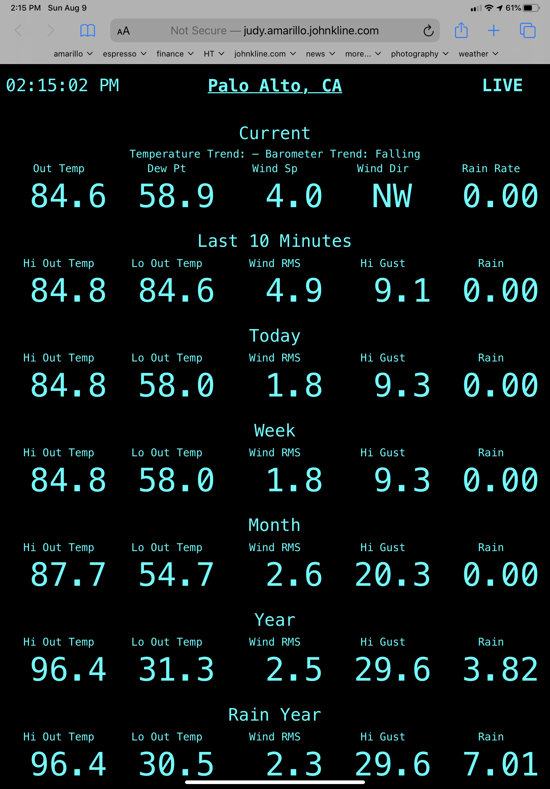

# weewx-loopdata
*Open source plugin for WeeWX software.

Copyright (C)2022-2024 by John A Kline (john@johnkline.com)

**This extension requires Python 3.7 or later and WeeWX 4 or 5.**

## Description

LoopData is a WeeWX service that generates a json file (loop-data.txt)
on every loop (e.g., every 2s).

Not: If you are upgrading to 3.0, you must install `python3-sortedcontainers`.
On debian, you can do this with: `apt install python3-sortedcontainers`

**IMPORTANT**: This extension has been tested with the WeeWX's vantage and cc3000 drivers.
It will likely also work with other drivers that, like the two drivers tested, report
loop packets on a regular basis and report all observations on every loop packet.
Use loopdata with driver's that report loop packets on an irregular basis and/or report
partial observations, at your own risk.

**IMPORTANT**: It is crucial to specify the correct loop frequency in the LoopData section
in the weewx.conf file.  For vantage and cc3000, this will be 2 seconds.
```
[LoopData]
    [[LoopFrequency]]                                                                                                                                                     
        seconds = 2.0
```

A sample skin, that uses the loopdata extension, is also included.  After installation,
it can be found at `<weewx-url>/loopdata/`.

The json file will contain any specified values for:
* observations in the loop packet (e.g., `current.outTemp`)
* rolling X min. aggregate values where X is 1 through 1440, inclusive (e.g., `2m.outTemp.max`, `30m.wind.gustdir`)
* rolling X hour aggregate values where X is 1 through 24, inclusive (e.g., `8h.outTemp.max`, `24h.wind.gustdir`)
* trends (e.g., `trend.barometer`) -- see time_delta below
* hourly aggregate values (e.g., `hour.outTemp.max`)
* daily aggregate values (e.g., `day.rain.sum`)
* weekly aggregate values (e.g., `week.wind.avg`)
* monthly aggregate values (e.g., `month.barometer.avg`)
* yearly aggregate values (e.g., `year.wind.max`)
* rainyear aggregate values (e.g., `rainyear.rain.sum`)
* alltime aggregate values (e.g., `alltime.outTemp.max`)


In addition to the usual observation types (which includes `windrun`), there
are special `windrun_<direction>` observation types that can be used with `current`,
`1m` through `1440m`, `1h` through `24h`, `trend`, `hour` and `day` periods.  These report the distance for each of sixteen
directions; and can be used to make a windrose.  Note: `windrun_<direction>` observations
are NOT supported for `week`, `month`, `year`, `rainyear` and `alltime` periods.

Note: `windrun_<direction>` observations are experimental and are likely to be moved to a
separate plugin (and available to loopdata).

* `windrun_N`
* `windrun_NNE`
* `windrun_NE`
* `windrun_ENE`
* `windrun_E`
* `windrun_ESE`
* `windrun_SE`
* `windrun_SSE`
* `windrun_S`
* `windrun_SSW`
* `windrun_SW`
* `windrun_WSW`
* `windrun_W``
* `windrun_WNW`
* `windrun_NW`
* `windrun_NNW`

The trend time_delta *cannot* be changed on a case by case basis, but
it can be changed for the entire target report (i.e., by using the standard
WeeWX customization):
```
    [[[Units]]]
        [[[[Trend]]]]
            time_delta = 86400    # for a 24 hour trend.
```
The default trend is 10800 (3 hours).  This is a WeeWX default.
Note: If time_delta > 259200 (3 days), LoopData will use a time_delta
of 259200 (3 days).

The json file will only include observations that are specified on the
`fields` line in the `LoopData` section of the weewx.conf file.

Typically, the loop-data.txt file is read by JavaScript on an HTML page
to update the values on the page on every loop packet.  This is demostrated
by the skin/report included with this extension.

A WeeWX report is specified in the LoopData configuration (e.g.,
`WeatherBoardReport`).  With this information, LoopData automatically converts
all values to the units called for in the report and also formats all
readings according to the report specification (unless `.raw` is specified,
e.g., `day.barometer.max.raw`).  Thus, it is simple to replace the reports
observations with updated values in JavaScript as they will already be in the
correct units and in the correct format.

LoopData is initially configured with a target report of LoopDataReport.
LoopDataReport is a sample report included with this extension.
After installing and restarting, and after waiting for a report cycle,
the loopdata report can be found at `<weewx-url>/loopdata/`:

**Every field in this report is updated on every loop packet.  That includes
the 2 minute, 10 minute, day, week, month, year, rain year and trend fields.**




The fields specified in weewx.conf on the fields line will be the keys
in the json file.  They are specified using WeeWX Cheetah syntax.

For example, the current outside temperature can be included as:

* `current.outTemp.formatted` which might yield `79.2`
* `current.outTemp`           which might yeild `79.2°F`
* `current.outTemp.raw`       which might yeild `79.175`

The maximum wind in the last 30m can be included as:

* `30m.wind.max.formatted` which might yeild `7.1`
* `30m.wind.max`           which might yeild `7.1 mph`
* `30m.wind.max.raw`       which might yeild `7.12`

The minimum outside temperature in the last 3 hours can be included as:

* `3h.outTemp.avg.formatted` which might yeild `32.4`
* `3h.outTemp.avg`           which might yeild `32.4°`
* `3h.outTemp.avg.raw`       which might yeild `32.41`

The inTemp average inside temperature this hour can be included as:

* `hour.inTemp.avg.formatted` which might yeild `68.1`
* `hour.inTemp.avg`           which might yeild `68.1°`
* `hour.inTemp.avg.raw`       which might yeild `68.12`

The day average of outside temperature can be included as:

* `day.outTemp.avg.formatted` which might yeild `64.7`
* `day.outTemp.avg`           which might yeild `64.7°`
* `day.outTemp.avg.raw`       which might yeild `64.711`

The wind speed average for this week can be included as:

* `week.windSpeed.avg.formatted` which might yeild `2.7`
* `week.windSpeed.avg`           which might yeild `2.7 mph`
* `week.windSpeed.raw`           which might yeild `2.74`

The minimum dewpoint this month the time of that event can be included as:

* `month.dewpoint.min`     which might yield `43.7°`
* `month.dewpoint.mintime` which might yeild `08/01/2020 03:27:00 AM`

The maximum wind speed this year and the time of that event can be included as:

* `year.wind.max`     which might yield `29.6 mph`
* `year.wind.maxtime` which might yeild `02/26/2020 07:40:00 PM`

The total rain for this rain year can be included as:

* `rainyear.rain.formatted` which might yeild `7.1`
* `rainyear.rain`           which might yeild `7.1 in`
* `rainyear.rain.raw`       which might yeild `7.13`

The alltime hight outside temperature can be included as:

* `alltime.outTemp.formatted` which might yeild `107.3`
* `alltime.outTemp`           which might yeild `107.3°`
* `alltime.outTemp.raw`       which might yeild `107.29`

If a field is requested, but the data is missing, the field will not be present
in loop-data.txt.  Your JavaScript should expect this and react
accordingly.

### How LoopData Works

LoopData gathers all of the necessary information at startup and then spawns a
separate thread.  The information gathered is only that which is needed
for LoopData to prime it's accumulators.  For example, if a week field is
included in the weewx.conf fields line (week.rain.sum), daily summaries
for the week will be read to prime the week accumulator.  If no week field
is included, no work will be done.  Ditto for alltime, rainyear, year, month, 1h-24h
and 1m-1440m accumulators.  They are populated only if they are used.  Lastly, only the
necessary observation types are tracked in the accumulators.  For example,
if no form of monthly.barometer is specified on the fields line, the monthly
accumulator will not accumulate baromter readings.

Once LoopData's thread starts and the accumulators are built, LoopData is
never touches touches the database and never consults WeeWX's accumulators.
It's only connection to the WeeWX main thread is that NEW_LOOP_PACKET is bound
to queue each loop packet.

### Period Aggregates implemented via xtypes are not currently supported by loopdata

Currently, if an aggregate is impemented via xtypes, it will be ignored by loopdata.
For example, the weewx-purple extension implements `pm2_5_aqi` via xtypes.  If,
say, `week.pm2_5_aqi.max` was specified as one of the fields on the fields line, it
would be ignored.  This is because there is no database entry from which to look up
the weekly high for `pm2_5_aqi`.

The rule is, if an observation is not stored in the database, you can't specify
aggregates.  Of course, loopdata will still report current values if you specify
them.


### Example of LoopData in Action

See weewx-loopdata in action with a WeatherBoard&trade; skin at
[www.paloaltoweather.com/weatherboard/](https://www.paloaltoweather.com/weatherboard/)
and in a "LiveSeasons" skin at
[www.paloaltoweather.com/](https://www.paloaltoweather.com/).

A WeatherBoard&trade; screenshot is below.


This extension was inspired by [weewx-realtime_gauge_data](https://github.com/gjr80/weewx-realtime_gauge-data).

# Installation Instructions

## WeeWX 5 Installation Instructions

1. Activate the virtual environment (actual syntax varies by type of WeeWX install):
   `/home/weewx/weewx-venv/bin/activate`

1. Install the sortedcontainers package.

   `pip install sortedcontainers`

1. Download the lastest release, weewx-loopdata-3.3.2.zip, from the
   [GitHub Repository](https://github.com/chaunceygardiner/weewx-loopdata).

1. Install the loopdata extension.

   `weectl extension install weewx-loopdata-3.3.2.zip`

1. The install creates a LoopData section in weewx.conf as shown below.  Adjust
   the values accordingly.  In particular:
   * Specify `seconds` with how often your device writes loopdata records
     (e.g., `2.0` for Davis Vantage Pro 2 and RainWise CC3000).
   * Specify the `target_report` for the report you wish to use for formatting and units
   * Specify the `loop_data_dir` where the loop-data.txt file should be writen.
     If `loop_data_dir` is a relative path, it will be interpreted as being relative to
     the target_report directory.
   * You will eventually need  to update the fields line with the fields you actually
     need for the report you are targetting.  Change this line later after you are sure
     LoopData is running correctly.
   * If you need the loop-data.txt file pushed to a remote webserver,
     you will also need to fill in the `RsyncSpec` fields; but one can fill
     that in later, after LoopData is up and running.

1. Restart WeeWX.

## WeeWX 4 Installation Instructions

1. Install the `python3-sortedcontainers` package.
   * On debian: `sudo apt install python3-sortedcontainers`

1. Download the lastest release, weewx-loopdata-3.3.2.zip, from the
   [GitHub Repository](https://github.com/chaunceygardiner/weewx-loopdata).

1. Run the following command.

   `sudo /home/weewx/bin/wee_extension --install weewx-loopdata-3.3.2.zip`

   Note: this command assumes weewx is installed in /home/weewx.  If it's installed
   elsewhere, adjust the path of wee_extension accordingly.

1. The install creates a LoopData section in weewx.conf as shown below.  Adjust
   the values accordingly.  In particular:
   * Specify `seconds` with how often your device writes loopdata records
     (e.g., `2.0` for Davis Vantage Pro 2 and RainWise CC3000).
   * Specify the `target_report` for the report you wish to use for formatting and units
   * Specify the `loop_data_dir` where the loop-data.txt file should be writen.
     If `loop_data_dir` is a relative path, it will be interpreted as being relative to
     the target_report directory.
   * You will eventually need  to update the fields line with the fields you actually
     need for the report you are targetting.  Change this line later after you are sure
     LoopData is running correctly.
   * If you need the loop-data.txt file pushed to a remote webserver,
     you will also need to fill in the `RsyncSpec` fields; but one can fill
     that in later, after LoopData is up and running.

1. Restart WeeWX.

## Checking for a Properly Running Installation

1. After a reporting cycle runs, navigate to `<weewx-url>/loopdata/ in your browser
   to see the default loopdata report. (Reports typcially run every 5 minutes.)

```
[LoopData]
    [[FileSpec]]
        loop_data_dir = .
        filename = loop-data.txt
    [[Formatting]]
        target_report = LoopDataReport
    [[LoopFrequency]]
        seconds = 2.0
    [[RsyncSpec]]
        enable = false
        remote_server = foo.bar.com
        remote_user = root
        remote_dir = /var/www/html
        compress = False
        log_success = False
        ssh_options = "-o ConnectTimeout=1"
        timeout = 1
        skip_if_older_than = 3
    [[Include]]
        fields = current.dateTime.raw, current.windDir.ordinal_compass, day.rain.sum, current.dewpoint, current.outTemp, current.rainRate, current.windSpeed, day.windGust.max, 10m.windGust.max, current.windSpeed
    [[BarometerTrendDescriptions]]
        RISING_VERY_RAPIDLY = Rising Very Rapidly
        RISING_QUICKLY = Rising Quickly
        RISING = Rising
        RISING_SLOWLY = Rising Slowly
        STEADY = Steady
        FALLING_SLOWLY = Falling Slowly
        FALLING = Falling
        FALLING_QUICKLY = Falling Quickly
        FALLING_VERY_RAPIDLY = Falling Very Rapidly
```

## Entries in `LoopData` sections of `weewx.conf`:
 * `loop_data_dir`     : The directory into which the loop data file should be written.
                         If a relative path is specified, it is relative to the
                         `target_report` directory.
 * `filename`          : The name of the loop data file to write.
 * `target_report`     : The WeeWX report to target.  LoopData will use this report to
                         determine the units to use and the formatting to apply.  Also,
                         if `loop_data_dir` is a relative path, it will be relative to
                         the directory of the directory of `target report `.  When
                         LoopData is first installed, target_report is set to
                         the sample report included with this skin: `LoopDataReport`.
 * `seconds`           : The frequency of loop packets emitted by your device.  This is
                         needed to give the proper weight to accumulator entries.  For
                         example, this value is `2.5` for Vantage Pro 2 devices and
                         `2.0` for RainWise CC3000 devices.
 * `enable`            : Set to true to rsync the loop data file to `remote_server`.
 * `remote_server`     : The server to which gauge-data.txt will be copied.
                         To use rsync to sync loop-data.txt to a remote computer, passwordless ssh
                         using public/private key must be configured for authentication from the user
                         account that weewx runs under on this computer to the user account on the
                         remote machine with write access to the destination directory (remote_dir).
 * `remote_user`       : The userid on remote_server with write permission to remote_server_dir.
 * `remote_directory`  : The directory on remote_server where filename will be copied.
 * `compress`          : True to compress the file before sending.  Default is False.
 * `log_success`       : True to write success with timing messages to the log (for debugging).
                         Default is False.
 * `ssh_options`       : ssh options Default is '-o ConnectTimeout=1' (When connecting, time out in
                         1 second.)
 * `timeout`           : I/O timeout. Default is 1.  (When sending, timeout in 1 second.)
 * `skip_if_older_than`: Don't bother to rsync if greater than this number of seconds.  Default is 4.
                         (Skip this and move on to the next if this data is older than 4 seconds.
 * `fields`            : Used to specify which fields to include in the file.
 * `BarometerTrendDescriptions` : The descriptions associated with trend.barometer.desc.  Localize as necessary.

## What fields are available.

Generally, if you can specify a field in a Cheetah template, and that field begins with $current,
`$trend`, `$day`, `$week`, `$month`, `$year`, or `$rainyear`, you can specify it here (but don't
include the dollar sign).  For all time, you can use `alltime`.  Also, you can use a `2m`, `10m`,
or `24h` prefix to get aggregate values for a rolling two, ten minutes, or 24 hours respectively.
`2m`, `10m` and `24h` act just like `day`, `week`, `month`, `year` `rainyear` and `alltime`.

For example, just like in a report, one can add the following extenstions to specialize the fields:
* `No extension`: Field is converted and formatted per the report and a label is added.
* `.raw`: field is converted per the report, but not formatted.
* `.formatted`: Field is converted and formatted per the report and no label is added.
* `.ordinal_compass`: for directional observations, the value is converted to text.

Note: `unit.label.<obs>` is also supported (e.g., `unit.label.<obs>`).

Lastly, `trend.barometer.desc` and `trend.barometer.code` are also supported.  `trend.barometer.desc`
provides a text version of the baromter rate (e.g., `Falling Slowly`).  Barometer trend descriptions
can be localized in the `LoopData` section of weewx.conf.  `trend.barometer.code` provides a integer
of value `-4`, `-3`, `-2`, `-1`, `0`, `1`, `2`, `3` or `4`.  These values correspond to `Falling Rapidly`, `
`Falling Quickly`, `Falling`, `Falling Slowly`, `Steady`, `Rising Slowly`, `Rising`, `Rising Quickly`
and `Rising Rapidly`, respectively.
```
[LoopData]
    [[BarometerTrendDescriptions]]
        RISING_VERY_RAPIDLY = Rising Very Rapidly
        RISING_QUICKLY = Rising Quickly
        RISING = Rising
        RISING_SLOWLY = Rising Slowly
        STEADY = Steady
        FALLING_SLOWLY = Falling Slowly
        FALLING = Falling
        FALLING_QUICKLY = Falling Quickly
        FALLING_VERY_RAPIDLY = Falling Very Rapidly
```

## Rsync isn't Working for me, help!
LoopData's uses WeeWX's `weeutil.rsyncupload.RsyncUpload` utility.  If you have rsync working
for WeeWX to push your web pages to a remote server, loopdata's rsync is likely to work too.
First get WeeWX working with rsync before you try to get loopdata working with rsync.

By the way, it's probably better  to put loop-data.txt outside of WeeWX's html tree so that
WeeWX's rsync and loopdata's rsync don't both write the loop-data.txt file.  If you're up
for configuring your websever to move it elsewhere (e.g., /home/weewx/loopdata/loop-data.txt),
you should do so.  If not, it's probably OK.  There just *might* be the rare complaint in the
log because the WeeWX main thread and the LoopData thread both tried to sync the same file at
the same time.

## Do I have to use rsync to sync loop-data.txt to a remote server?
You don't *have* to sync to a remote server; but if you want to sync to a remote server,
rsync is the *only* mechanism provided.

## What about those rsync errors in the log?
If one is using rsync, especially if the loop interval is short (e.g., 2s), it is expected that
there will be log entries for connection timeouts, transmit timeouts, write errors and skipped
packets.  By default only one second is allowed to connect or transmit the data.  Also, by
default, if the loop data is older than 3s, it is skipped.  With these settings, the remote
server may miss receiving some loop-data packets, but it won't get caught behind trying to send
a backlog of old loop data.

Following are examples of a connection timeout, transmission timeout, writer error and a skipped
packet.  These errors are fine in moderation.  If too many packets are timing out, one might try
changing the connection timeout or timeout values.
```
Jul  1 04:12:03 charlemagne weewx[1126] ERROR weeutil.rsyncupload: [['rsync', '--archive', '--stats', '--timeout=1', '-e ssh -o ConnectTimeout=1', '/home/weewx/gauge-data/loop-data.txt', 'root@www.paloaltoweather.com:/home/weewx/gauge-data/loop-data.txt']] reported errors: ssh: connect to host www.paloaltoweather.com port 22: Connection timed out. rsync: connection unexpectedly closed (0 bytes received so far) [sender]. rsync error: unexplained error (code 255) at io.c(235) [sender=3.1.3]
Jun 30 20:51:48 charlemagne weewx[1126] ERROR weeutil.rsyncupload: [['rsync', '--archive', '--stats', '--timeout=1', '-e ssh -o ConnectTimeout=1', '/home/weewx/gauge-data/loop-data.txt', 'root@www.paloaltoweather.com:/home/weewx/gauge-data/loop-data.txt']] reported errors: [sender] io timeout after 1 seconds -- exiting. rsync error: timeout in data send/receive (code 30) at io.c(204) [sender=3.1.3]
Jun 27 10:18:37 charlemagne weewx[17982] ERROR weeutil.rsyncupload: [['rsync', '--archive', '--stats', '--timeout=1', '-e ssh -o ConnectTimeout=1', '/home/weewx/gauge-data/loop-data.txt', 'root@www.paloaltoweather.com:/home/weewx/gauge-data/loop-data.txt']] reported errors: rsync: [sender] write error: Broken pipe (32). rsync error: error in socket IO (code 10) at io.c(829) [sender=3.1.3]
Jun 27 23:15:53 charlemagne weewx[10156] INFO user.loopdata: skipping packet (2020-06-27 23:15:50 PDT (1593324950)) with age: 3.348237
```

## Why require Python 3.7 or later?

LoopData code includes type annotation which do not work with Python 2, nor in
earlier versions of Python 3.

## Licensing

weewx-loopdata is licensed under the GNU Public License v3.
