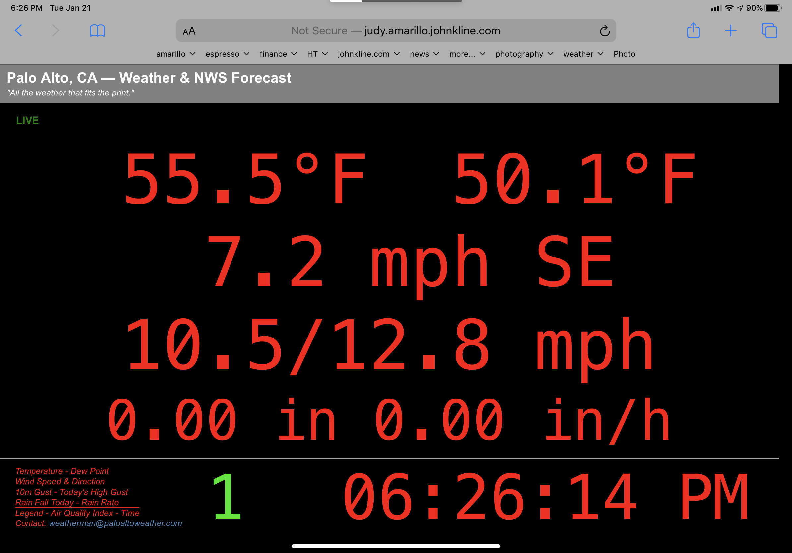

# weewx-loopdata
*Open source plugin for WeeWX software.

Copyright (C)2020 by John A Kline (john@johnkline.com)

**This extension requires Python 3.7 or later and WeeWX 4.**

**LoopData 2.x is a breaking change from 1.x.  See "How to Upgrade from LoopData 1.x." below.**

## Description

LoopData is a WeeWX service that generates a json file (loop-data.txt)
on every loop (e.g., every 2s).  Contained in the json are values for:

* observations in the loop packet (e.g., `current.outTemp`)
* rolling 10 min. aggregate values (e.g., `10m.outTemp.max`, `10m.wind.gustdir`)
* trends (e.g., `trend.barometer`) -- see time_delta below
* daily aggregate values (e.g., `day.rain.sum`)

The following also work, but will extend weewx startup time
(see `Using week, month, year and rainyear Fields` below):
* weekly aggregate values (e.g., `week.wind.avg`)
* monthly aggregate values (e.g., `month.barometer.avg`)
* yearly aggregate values (e.g., `year.wind.max`)
* rainyear-ly aggregate values (e.g., `rainyear.rain.sum`)

The trend time_delta *cannot* be changed on a cast by case basis, but
it can be changed for the entire target report (i.e., by using the standard
WeeWX customization):
```
    [[[Units]]]
        [[[[Trend]]]]
            time_delta = 86400    # for a 24 hour trend.
```
The default trend is 10800 (3 hours).  This is a WeeWX default.

The json file will only include observations that are specified on the
`fields` line in the `LoopData` section of the weewx.conf file.

Typically, the loop-data.txt file is read by JavaScript on an HTML page
to update the values on the page on every loop packet.

A WeeWX report is specified in the LoopData configuration (e.g.,
`WeatherBoardReport`).  With this information, LoopData automatically converts
all values to the units called for in the report and also formats all
readings according to the report specification (unless `.raw` is specified,
e.g., `day.barometer.max.raw`).  Thus, it is simple to replace the reports
observations with updated values in JavaScript as they will already be in the
correct units and in the correct format.

The fields specified in weewx.conf on the fields line will be the keys
in the json file.  They are specified using WeeWX Cheetah syntax.

For example, the current outside temperature can be included as:

* `current.outTemp.formatted` which might yield `79.2`
* `current.outTemp`          which might yeild `79.2°F`
* `current.outTemp.raw`      which might yeild `79.175`

The day average of outside tempeture can be included as:

* `day.outTemp.avg.formatted`which might yeild `64.7`
* `day.outTemp.avg`          which might yeild `64.7°`
* `day.outTemp.avg.raw`      which might yeild `64.711`

If a field is requested, but the data is missing, it will not be present
in loop-data.txt.  Your JavaScript should expect this and react
accordingly.

### How LoopData Works

LoopData gathers all of the necessary information at startup and then spawns a
separate thread.  The information gathered is only that which is needed
for LoopData to prime it's accumulators.  For example, if a week field is
included in the weewx.conf fields line (week.rain.sum), archive recordds from
the beginning of the week until present will be read to prime the week
accumulator.  If no week field is include, this isn't necessary.  Ditto
for rainyear, year, month and 10m accumulators.  They are populated only
if they are used.  Lastly, only the necessary observation types are tracked
in the accumulators.  For example, if no flavor of monthy.barometer is
specified on the fields line, the monthly accumulator will not accumulate
baromter readings.

Once LoopData's thread starts and the accumulators are built, LoopData is
efficient and never touches any other part of WeeWX.  It's only connection
to the WeeWX main thread is that NEW_LOOP_PACKET is bound to queue each
loop packet.

### Using week, month, year and rainyear Fields

Since LoopData primes its accumlators at startup with archive records, there
can be a significant startup penalty to use week, month, year and rainyear
fields. Please keep this in mind when deciding whether or not to use these
fields.  This should be The aren't may applications where using these fields.

Below are increases in startup time to use each type of field.  Of course, the
times are not cumulative.  For example, if you are using one or more month
fields, that might add 2.6s of start up time on a Raspbery Pi 4 (no matter how
many month fields you are using).  Adding week fields would not add any
more to the startup time since the needed records are already being read to
accmodate the month field(s).

#### Estimated Added Startup Time on a NUC 7i5

* `rainyear` ~5.5s  (365 days into rainyear)
* `year`     ~5.5s  (365 days into year)
* `month`    ~0.5s  (end of a 31 day month)
* `week`     ~0.1s  (end of a week)

#### Estimated Added Startup Time on a Raspbery Pi 4

* `rainyear` ~25.0s (365 days into rainyear)
* `year`     ~25.0s (365 days into year)
* `month`     ~2.6s (end of a 31 day month)
* `week`      ~0.6s (end of a week)

### Example of LoopData in Action

See weewx-loopdata in action with a WeatherBoard&trade; skin at
[www.paloaltoweather.com/weatherboard/](https://www.paloaltoweather.com/weatherboard/)
and in a "LiveSeasons" skin at
[www.paloaltoweather.com/](https://www.paloaltoweather.com/).

A WeatherBoard&trade; screenshot is below.



This extension was inspired by [weewx-realtime_gauge_data](https://github.com/gjr80/weewx-realtime_gauge-data).
This does not attempt to duplicate Gary's fantastic realtime gauge data plugin
for SteelSeries gauges.  In fact, I use that great extension [here](https://www.paloaltoweather.com/LiveSeasonsGauges/).
If you want to power Steel Series gauges from WeeWX, you definitely want to use Gary's extension.

# Installation Instructions

1. Download the lastest release, weewx-loopdata-2.0.1.zip, from the
   [GitHub Repository](https://github.com/chaunceygardiner/weewx-loopdata).

1. Run the following command.

   `sudo /home/weewx/bin/wee_extension --install weewx-loopdata-2.0.1.zip`

   Note: this command assumes weewx is installed in /home/weewx.  If it's installed
   elsewhere, adjust the path of wee_extension accordingly.

1. The install creates a LoopData section in weewx.conf as shown below.  Adjust
   the values accordingly.  In particular, specify the `target_report` for the
   report you wish to use for formatting and units and specify the `loop_data_dir`
   where the loop-data.txt file should be writen.  If `loop_data_dir` is a relative
   path, it will be interpreted as being relatgive to the target_report directory.
   You will eventually need  to update the fields line with the fields you actually
   need for the report you are targetting.  If you know them now, fill them in.
   If not, you can change this line later after you are sure LoopData is running
   correctly.  If you need the loop-data.txt file pushed to a remote webserver,
   you will also need to fill in the `RsyncSpec` fields; but one can fill
   that in later, after LoopData is up and running.

```
[LoopData]
    [[FileSpec]]
        loop_data_dir = .
        filename = loop-data.txt
    [[Formatting]]
        target_report = WeatherBoardReport
    [[RsyncSpec]]
        enable = false
        remote_server = foo.bar.com
        remote_user = root
        remote_dir = /var/www/html
        compress = False
        log_success = False
        ssh_options = "-o ConnectTimeout=1"
        timeout = 1
        skip_if_older_than = 3
    [[Include]]
        fields = current.dateTime.raw, current.windDir.ordinal_compass, day.rain.sum, current.dewpoint, current.outTemp, current.rainRate, current.windSpeed, day.windGust.max, 10m.windGust.max, current.windSpeed
    [[BarometerTrendDescriptions]]
        RISING_VERY_RAPIDLY = Rising Very Rapidly
        RISING_QUICKLY = Rising Quickly
        RISING = Rising
        RISING_SLOWLY = Rising Slowly
        STEADY = Steady
        FALLING_SLOWLY = Falling Slowly
        FALLING = Falling
        FALLING_QUICKLY = Falling Quickly
        FALLING_VERY_RAPIDLY = Falling Very Rapidly
```

## Entries in `LoopData` sections of `weewx.conf`:
 * `loop_data_dir`     : The directory into which the loop data file should be written.
                         If a relative path is specified, it is relative to the
                         `target_report` directory.
 * `filename`          : The name of the loop data file to write.
 * `target_report`     : The WeeWX report to target.  LoopData will use this report to
                         determine the units to use and the formatting to apply.  Also,
                         if `loop_data_dir` is a relative path, it will be relative to
                         the directory of the directory of `target report `.
 * `enable`            : Set to true to rsync the loop data file to `remote_server`.
 * `remote_server`     : The server to which gauge-data.txt will be copied.
                         To use rsync to sync loop-data.txt to a remote computer, passwordless ssh
                         using public/private key must be configured for authentication from the user
                         account that weewx runs under on this computer to the user account on the
                         remote machine with write access to the destination directory (remote_dir).
 * `remote_user`       : The userid on remote_server with write permission to remote_server_dir.
 * `remote_directory`  : The directory on remote_server where filename will be copied.
 * `compress`          : True to compress the file before sending.  Default is False.
 * `log_success`       : True to write success with timing messages to the log (for debugging).
                         Default is False.
 * `ssh_options`       : ssh options Default is '-o ConnectTimeout=1' (When connecting, time out in
                         1 second.)
 * `timeout`           : I/O timeout. Default is 1.  (When sending, timeout in 1 second.)
 * `skip_if_older_than`: Don't bother to rsync if greater than this number of seconds.  Default is 4.
                         (Skip this and move on to the next if this data is older than 4 seconds.
 * `fields`            : Used to specify which fields to include in the file.
 * `BarometerTrendDescriptions` : The descriptions associated with trand.barometer.desc.  Localize as necessary.

## What fields are available.

Generally, if you can specify a field in a Cheetah template, and that field begins with $current,
`$day` or `$trend`, you can specify it here (don't include the dollar sign).  Also, anything you
can specify with `day.`, you can also specify with `10m.` and the aggregate will apply to a
rolling 10 minute window.

For example, just like in a report, one can add the following extenstions to specialize the fields:
* No extension specified`: Field is converted and formatted per the report.  A label is added.
* `.raw`: field is converted per the report, but not formatted.
* `.formatted`: Field is converted and formatted per the report.  NO label is added.
* `.ordinal_compass`: for directional observations, the value is converted to text.

Note: `unit.label.<obs>` is also supported (e.g., `unit.label.<obs>`).

Lastly, `trend.barometer.desc` is also supported and provides a text version of the
baromter rate (e.g., `Falling Slowly`).  Baromter trend descriptions can be localize in
the `LoopData` section of weewx.conf
```
[LoopData]
    [[BarometerTrendDescriptions]]
        RISING_VERY_RAPIDLY = Rising Very Rapidly
        RISING_QUICKLY = Rising Quickly
        RISING = Rising
        RISING_SLOWLY = Rising Slowly
        STEADY = Steady
        FALLING_SLOWLY = Falling Slowly
        FALLING = Falling
        FALLING_QUICKLY = Falling Quickly
        FALLING_VERY_RAPIDLY = Falling Very Rapidly
```

## Rsync isn't Working for Me, Help!
LoopData's uses WeeWX's `weeutil.rsyncupload.RsyncUpload` utility.  If you have rsync working
for WeeWX to push your web pages to a remote server, loopdata's rsync is likely to work too.
First get WeeWX working with rsync before you try to get loopdata working with rsync.

By the way, it's best to put loop-data.txt outside of WeeWX's html tree so that WeeWX's rsync
and loopdata's rsync don't both write the loop-data.txt file.  If you're up for configuring
your websever to move it elsewhere (e.g., /home/weewx/loopdata/loop-data.txt), you should
do so.  If not, it's probably OK.  There just *might* be the rare complaint in the log
because the WeeWX main thread and the LoopData thread both tried to sync the same file at
the same time.

## Do I have to use rsync to sync loop-data.txt to a remote server?
You don't have to sync to a remote server; but if you do want to sync to a remote server,
rsync is the only mechanism provided.

## About those Rsync Errors in the Log
If one is using rsync, especially if the loop interval is short (e.g., 2s), it is expected that
there will be log entries for connection timeouts, transmit timeouts, write errors and skipped
packets.  By default only one second is allowed to connect or transmit the data.  Also, by
default, if the loop data is older than 3s, it is skipped.  With these settings, the remote
server may miss receiving some loop-data packets, but it won't get caught behind trying to send
a backlog of old loop data.

Following are examples of a connection timeout, transmission timeout, writer error and a skipped
packet.  These errors are fine in moderation.  If too many packets are timing out, one might try
changing the connection timeout or timeout values.
```
Jul  1 04:12:03 charlemagne weewx[1126] ERROR weeutil.rsyncupload: [['rsync', '--archive', '--stats', '--timeout=1', '-e ssh -o ConnectTimeout=1', '/home/weewx/gauge-data/loop-data.txt', 'root@www.paloaltoweather.com:/home/weewx/gauge-data/loop-data.txt']] reported errors: ssh: connect to host www.paloaltoweather.com port 22: Connection timed out. rsync: connection unexpectedly closed (0 bytes received so far) [sender]. rsync error: unexplained error (code 255) at io.c(235) [sender=3.1.3]
Jun 30 20:51:48 charlemagne weewx[1126] ERROR weeutil.rsyncupload: [['rsync', '--archive', '--stats', '--timeout=1', '-e ssh -o ConnectTimeout=1', '/home/weewx/gauge-data/loop-data.txt', 'root@www.paloaltoweather.com:/home/weewx/gauge-data/loop-data.txt']] reported errors: [sender] io timeout after 1 seconds -- exiting. rsync error: timeout in data send/receive (code 30) at io.c(204) [sender=3.1.3]
Jun 27 10:18:37 charlemagne weewx[17982] ERROR weeutil.rsyncupload: [['rsync', '--archive', '--stats', '--timeout=1', '-e ssh -o ConnectTimeout=1', '/home/weewx/gauge-data/loop-data.txt', 'root@www.paloaltoweather.com:/home/weewx/gauge-data/loop-data.txt']] reported errors: rsync: [sender] write error: Broken pipe (32). rsync error: error in socket IO (code 10) at io.c(829) [sender=3.1.3]
Jun 27 23:15:53 charlemagne weewx[10156] INFO user.loopdata: skipping packet (2020-06-27 23:15:50 PDT (1593324950)) with age: 3.348237
```

## Why require Python 3.7 or later?

LoopData code includes type annotation which do not work with Python 2, nor in
earlier versions of Python 3.

# How to Upgrade from LoopData 1.x.

[PLEASE NOTE: IF YOU ARE NOT UPGRADING FROM LoopData 1.x, no good will come from reading
this section.  Furthermore, it may confuse you.  If you are looking for what fields
can be in `loop-data.txt`, look for fields in your reports.  It is those you can add
in `loop-data.txt`.]

LoopData 2.x is a breaking change to 1.x installations. The following steps will help guide 
you through the process:

1. Install 2.x as per above instructions, but DO NOT restart WeeWX.

1. Edit the LoopData->Include->fields line in weewx.conf.  Every field listed needs to be
   translated into the new (Cheetah) style of specifying fields.

 * `dateTime`           -> `current.dateTime.raw`
 * `<obs>`              -> `current.<obs>.formatted`
 * `10mMaxGust`         -> `10m.windGust.max.formatted`
 * `AVG_<obs>`          -> `day.<obs>.avg`
 * `barometerRate`      -> `trend.barometer.formatted`
 * `COMPASS_<obs>`      -> `current.<obs>.ordinal_compass`
 * `DESC_barometerRate` -> `trend.barometer.desc`
 * `FMT_<obs>`          -> `current.<obs>`
 * `FMT_10mMaxGust`     -> `10m.windGust.max`
 * `FMT_AVG_<obs>`      -> `day.<obs>.avg.formatted`
 * `FMT_barometerRate`  -> `trend.barometer`
 * `FMT_HI_<obs>`       -> `day.<obs>.max`
 * `FMT_LO_<obs>`       -> `day.<obs>.min`
 * `FMT_T_HI_<obs>`     -> `day.<obs>.maxtime`
 * `FMT_T_LO_<obs>`     -> `day.<obs>.mintime`
 * `HI_<obs>`           -> `day.<obs>.max.formatted`
 * `LABEL_<obs>`        -> `unit.label.<obs>`
 * `LO_<obs>`           -> `day.<obs>.min.formatted`
 * `RMS_<obs>`          -> `day.<obs>.rms`
 * `SUM_<obs>`          -> `day.<obs>.sum`
 * `T_10mMaxGust`       -> `10m.windGust.maxtime`
 * `T_HI_<obs>`         -> `day.<obs>.maxtime.formatted`
 * `T_LO_<obs>`         -> `day.<obs>.mintime.formatted`
 * `VEC_AVG_<obs>`      -> `day.<obs>.vecavg`
 * `VEC_DIR_<obs`       -> `day.<obs>.vecdir`

1. Make the same changes as above to your .tmpl and JavaScript files for the skins
   that are using LoopData.  Note: A 2.x version of WeatherBoard has been released.  It uses
   the new naming scheme.

The followiung have been removed from LoopData: `windRose` observations,
`UNITS_<obs>` fields and the capability to `rename` the keys in loop-data.txt.

## Licensing

weewx-loopdata is licensed under the GNU Public License v3.
