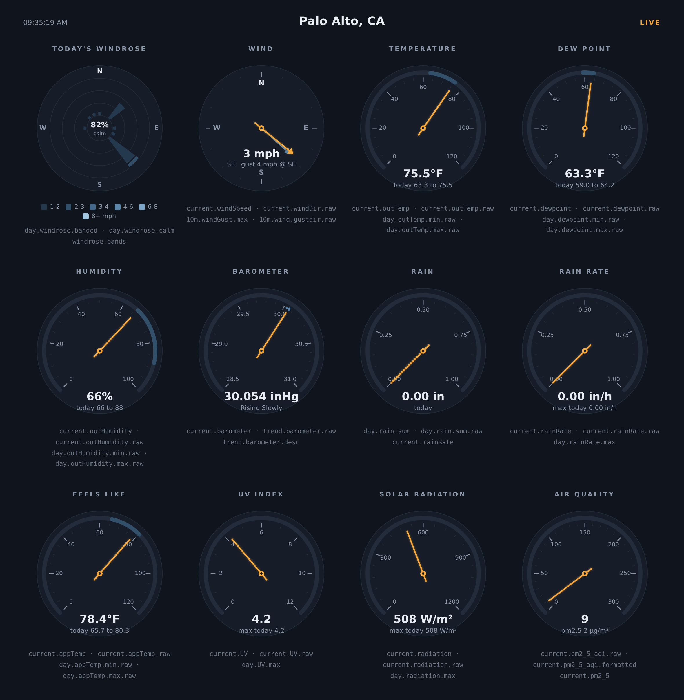
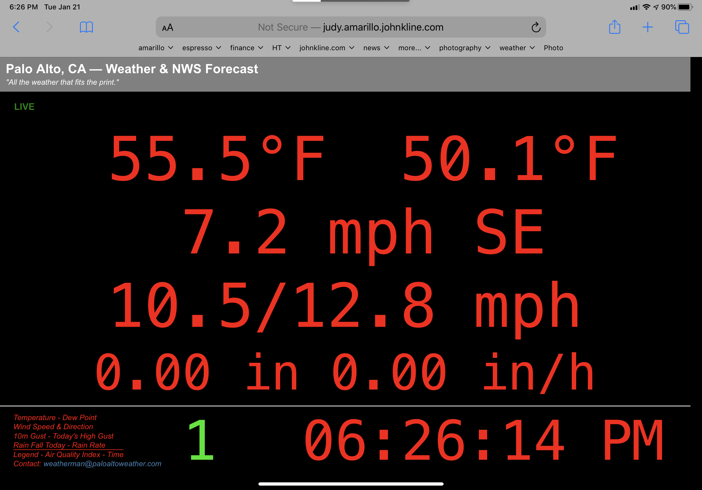

# weewx-loopdata – Make your skins come alive!

Copyright (C)2022-2026 by John A Kline (john@johnkline.com)

**This extension requires Python 3.7 or later and WeeWX 4 or 5.**

## Description

With LoopData, the tags in your WeeWX reports can be updated on every LOOP
packet — typically every few seconds — instead of waiting for the next archive
interval and page reload.  This works for nearly every tag you would use in a
report: current observations, trends, aggregates over hours, days, weeks,
months, years and rolling windows — including almanac tags and unit labels.

This is the sample report included with this extension — a NOAA-style
windrose and eleven gauges, drawn by a few hundred lines of dependency-free
canvas javascript.  Every needle, petal and readout on this page redraws on
every loop packet, and gauges for sensors a station does not have (UV,
solar radiation, air quality) hide themselves automatically:



Here is the whole idea in one example.  Say your report template shows a
current condition, a daily aggregate and an almanac time:

```
Temperature: $current.outTemp
High today: $day.outTemp.max
Sunset: $almanac.sunset
```

List those same tags — with the `$` removed — on the `fields` line of the
`[LoopData]` section of weewx.conf:

```
[LoopData]
    [[Include]]
        fields = current.outTemp, day.outTemp.max, almanac.sunset
```

Now, on every loop packet, LoopData writes a json file, `loop-data.txt`, with
those tags as its keys — and every value already unit-converted and formatted
exactly as your report would render it:

```json
{"current.outTemp": "79.2°F", "day.outTemp.max": "85.1°F", "almanac.sunset": "20:32"}
```

Finally, in the template, wrap each tag in an element whose id is the tag, and
add a few lines of javascript to fill those elements from loop-data.txt:

```html
Temperature: <span id="current.outTemp">$current.outTemp</span><br/>
High today: <span id="day.outTemp.max">$day.outTemp.max</span><br/>
Sunset: <span id="almanac.sunset">$almanac.sunset</span>

<script>
  async function updateLoopData() {
    const response = await fetch('loop-data.txt', {cache: 'no-store'});
    const data = await response.json();
    for (const key in data) {
      const element = document.getElementById(key);
      if (element) element.innerHTML = data[key];
    }
  }
  setInterval(updateLoopData, 2000);  // match your loop frequency
</script>
```

The page loads showing the values Cheetah rendered at report time, then comes
alive: every wrapped tag updates as fast as your station reports.  That is all
there is to it.  The rest of this README is reference — the full field grammar
(periods, aggregates, unit overrides, rounding, format specs), the live
windrose, almanac fields, configuration and rsync to a remote web server —
and "Using LoopData in Your Own Skin" below adds the production touches
(error handling, missing fields, a LIVE indicator) to the javascript above.

Note: As of version 4.0, the `sortedcontainers` package is no longer required
(it was required by versions 3.0 through 3.9).

**IMPORTANT**: This extension has been tested with the WeeWX vantage and cc3000 drivers.
It will likely also work with other drivers that, like the two drivers tested, report
loop packets on a regular basis and report all observations on every loop packet.
Use loopdata with drivers that report loop packets on an irregular basis and/or report
partial observations, at your own risk.

**IMPORTANT**: It is crucial to specify the correct loop frequency in the LoopData section
in the weewx.conf file.  For vantage and cc3000, this will be 2 seconds.
```
[LoopData]
    [[LoopFrequency]]                                                                                                                                                     
        seconds = 2.0
```

A sample skin, that uses the loopdata extension, is also included.  After installation,
it can be found at `<weewx-url>/loopdata/`.

The json file will contain any specified values for:
* observations in the loop packet (e.g., `current.outTemp`)
* rolling X min. aggregate values where X is 1 through 1440, inclusive (e.g., `2m.outTemp.max`, `30m.wind.gustdir`)
* rolling X hour aggregate values where X is 1 through 24, inclusive (e.g., `8h.outTemp.max`, `24h.wind.gustdir`)
* trends (e.g., `trend.barometer`) -- see time_delta below
* hourly aggregate values (e.g., `hour.outTemp.max`)
* daily aggregate values (e.g., `day.rain.sum`)
* weekly aggregate values (e.g., `week.wind.avg`)
* monthly aggregate values (e.g., `month.barometer.avg`)
* yearly aggregate values (e.g., `year.wind.max`)
* rainyear aggregate values (e.g., `rainyear.rain.sum`)
* alltime aggregate values (e.g., `alltime.outTemp.max`)
* almanac values (new in 5.0) -- any WeeWX report almanac tag with the `$`
  removed (e.g., `almanac.sunrise`, `almanac.moon_phase`,
  `almanac(horizon=-6).sun(use_center=1).rise.raw`), computed live on every
  loop record -- see the "Almanac fields" section below


In addition to the usual observation types (which includes `windrun`), there is
a special `windrose` observation type (new in 6.0, replacing the experimental
`windrun_<direction>` types) for building a live NOAA-style windrose.  For each
period, loopdata accumulates a matrix of sixteen compass bins (N, NNE, NE, ...
NNW — clockwise from north) by N wind-speed bands, tracking both time and
distance per cell, plus a directionless "calm" total.  `windrose` works with
every period except `current` and `trend` — including `week`, `month`, `year`,
`rainyear` and `alltime` (the old `windrun_<direction>` types stopped at `day`).

Four aggregates project that matrix into json:

* `day.windrose.sum` — sixteen distances (the classic windrun rose), unit-converted
  to the target report's distance unit; supports a unit override
  (`day.windrose.sum.km`) and `.formatted` (an array of report-formatted strings).
  Note: wind below the calm threshold counts as calm time, not distance — there
  is no reliable direction to attribute it to — so on a near-calm day `.sum`
  can be all zeros while `windrun` shows a small total.
* `day.windrose.time` — sixteen durations in seconds (a frequency rose)
* `day.windrose.banded` — the full 16-by-N matrix of seconds per speed band
  (the NOAA rose; divide by total time for percentages)
* `day.windrose.calm` — seconds of calm: wind below the calm threshold, or no
  wind direction.  Render it as the rose's center-circle percentage.

Arrays are emitted as json numbers (charting javascript wants numbers, not
strings); `.round(n)` applies per element (e.g. `day.windrose.sum.round(2)`).
Whenever any windrose field is configured, loopdata also emits a
`windrose.bands` key holding the band edges in the target report's windSpeed
unit, so a page's legend never hardcodes them.  `unit.label.windrose` yields
the distance unit label for `.sum`.

The speed bands default to the classic WRPLOT/NOAA bands — 0.5, 2.1, 3.6, 5.7,
8.8 and 11.1 m/s, converted to the target report's windSpeed unit and rounded
to one decimal.  The first edge doubles as the calm threshold.  To override,
list ascending edges (in the target report's windSpeed unit) in the `LoopData`
section of weewx.conf:

```
[LoopData]
    windrose_bands = 1, 4, 8, 13, 19, 25
```

The default bands suit a windy site; on a light-wind site most of the rose can
land in the lowest band (or below the calm threshold entirely).  Your archive
already knows what your site does — one query shows how your time divides
across wind speeds (values are in your database's unit; convert if your report
unit differs):

```
sqlite3 weewx.sdb "SELECT CAST(windSpeed AS INT) AS speed, \
  ROUND(100.0 * SUM(interval) / (SELECT SUM(interval) FROM archive \
  WHERE windSpeed IS NOT NULL), 1) AS pct_of_time \
  FROM archive WHERE windSpeed IS NOT NULL GROUP BY speed;"
```

Then place the edges by three rules:

* **Calm threshold** (the first edge): at or just below the smallest non-zero
  speed your console reports.  Integer-reporting consoles (e.g. Davis Vantage,
  in mph) spend a lot of time at exactly 1 — an edge of 1.1 silently counts
  all of it as calm, an edge of 1 keeps it in the rose.  Calm percentages of
  10–40% are normal on real roses.
* **Middle edges**: place them so each band carries a real share of the
  non-calm time (a few percent at minimum) — a band that never fills is a
  wasted legend entry, and one band holding most of the time is a monochrome
  rose.
* **Top edge**: rare on purpose — around the speed you exceed only a few
  hours a year (the 99.5th percentile or so), so the darkest color flags
  genuinely notable wind rather than never appearing at all.

Round numbers in the report unit make the best legend.  Iterating is cheap:
changing the bands is just an edit and a weewxd restart — every period
reseeds from the archive at startup, so the whole rose re-buckets under the
new edges.

The sample LoopData skin draws a live canvas windrose from
`day.windrose.banded` and `day.windrose.calm` — see
`skins/LoopData/realtime_updater.inc` for javascript to crib from.

Upgrading from `windrun_<direction>` fields: `day.windrun_N.sum` is now element
0 of `day.windrose.sum`, `day.windrun_NNE.sum` element 1, and so on clockwise.

The trend time_delta *cannot* be changed on a case by case basis, but
it can be changed for the entire target report (i.e., by using the standard
WeeWX customization):
```
    [[[Units]]]
        [[[[Trend]]]]
            time_delta = 86400    # for a 24 hour trend.
```
The default trend is 10800 (3 hours).  This is a WeeWX default.
Note: If time_delta > 259200 (3 days), LoopData will use a time_delta
of 259200 (3 days).

The json file will only include observations that are specified on the
`fields` line in the `LoopData` section of the weewx.conf file.

Typically, the loop-data.txt file is read by JavaScript on an HTML page
to update the values on the page on every loop packet.  This is demonstrated
by the skin/report included with this extension.

A WeeWX report is specified in the LoopData configuration (e.g.,
`WeatherBoardReport`).  With this information, LoopData automatically converts
all values to the units called for in the report and also formats all
readings according to the report specification (unless `.raw` is specified,
e.g., `day.barometer.max.raw`).  Thus, it is simple to replace the reports
observations with updated values in JavaScript as they will already be in the
correct units and in the correct format.

LoopData is initially configured with a target report of LoopDataReport, the
instrument-panel sample report pictured at the top of this README:
temperature, dew point, feels-like and humidity dials wear today's min–max
as a band, the wind compass carries a second ghost needle at the 10-minute
gust direction, the barometer draws the 3-hour trend as an arc, rain and
rain-rate dials rescale themselves on a big day, and the windrose is the
NOAA banded kind.  The `.raw` fields drive the geometry, report-formatted
fields supply the readouts, and `unit.label` fields pick the dial scales,
so the panel follows the target report's units and formatting like any
other loopdata page.  Gauges for observations a station does not report —
UV, solar radiation, air quality (weewx-purple's `pm2_5_aqi`), and
feels-like where appTemp is not computed — hide themselves, and reappear
if the field shows up in loop-data.txt.  After installing and restarting,
and after waiting for a report cycle, it can be found at
`<weewx-url>/loopdata/`.


The fields specified in weewx.conf on the fields line will be the keys
in the json file.  They are specified using WeeWX Cheetah syntax.

For example, the current outside temperature can be included as:

* `current.outTemp.formatted` which might yield `79.2`
* `current.outTemp`           which might yield `79.2°F`
* `current.outTemp.raw`       which might yield `79.175`

The maximum wind in the last 30m can be included as:

* `30m.wind.max.formatted` which might yield `7.1`
* `30m.wind.max`           which might yield `7.1 mph`
* `30m.wind.max.raw`       which might yield `7.12`

The average outside temperature over the last 3 hours can be included as:

* `3h.outTemp.avg.formatted` which might yield `32.4`
* `3h.outTemp.avg`           which might yield `32.4°`
* `3h.outTemp.avg.raw`       which might yield `32.41`

The average inside temperature this hour can be included as:

* `hour.inTemp.avg.formatted` which might yield `68.1`
* `hour.inTemp.avg`           which might yield `68.1°`
* `hour.inTemp.avg.raw`       which might yield `68.12`

The day average of outside temperature can be included as:

* `day.outTemp.avg.formatted` which might yield `64.7`
* `day.outTemp.avg`           which might yield `64.7°`
* `day.outTemp.avg.raw`       which might yield `64.711`

The wind speed average for this week can be included as:

* `week.windSpeed.avg.formatted` which might yield `2.7`
* `week.windSpeed.avg`           which might yield `2.7 mph`
* `week.windSpeed.avg.raw`       which might yield `2.74`

Time-of-event fields (`maxtime`, `mintime`, `firsttime`, `lasttime`) are
formatted exactly as WeeWX report tags format them: the field's period is the
time context, so the target report's `[Units][TimeFormats]` entry for that
period applies (with the standard settings: `hour` is `%H:%M`, `day` is `%X`,
`week` is `%X (%A)`, `month`/`year`/`rainyear` are `%x %X`).  `alltime` uses
the `year` format, as WeeWX's `$alltime` tag does.  Rolling periods
(`1m`-`1440m`, `1h`-`24h`) use the `current` format.  For example:

* `day.outTemp.maxtime`   which might yield `12:00:00`
* `hour.outTemp.maxtime`  which might yield `12:00`

The minimum dewpoint this month and the time of that event can be included as:

* `month.dewpoint.min`     which might yield `43.7°`
* `month.dewpoint.mintime` which might yield `08/01/2020 03:27:00 AM`

The maximum wind speed this year and the time of that event can be included as:

* `year.wind.max`     which might yield `29.6 mph`
* `year.wind.maxtime` which might yield `02/26/2020 07:40:00 PM`

The total rain for this rain year can be included as:

* `rainyear.rain.sum.formatted` which might yield `7.1`
* `rainyear.rain.sum`           which might yield `7.1 in`
* `rainyear.rain.sum.raw`       which might yield `7.13`

The alltime high outside temperature can be included as:

* `alltime.outTemp.max.formatted` which might yield `107.3`
* `alltime.outTemp.max`           which might yield `107.3°`
* `alltime.outTemp.max.raw`       which might yield `107.29`

If a field is requested, but the data is missing, the field will not be present
in loop-data.txt — unless the field uses `string()` or an explicit
`None_string` argument (see "Formatting a field with arguments" under "What
fields are available"), in which case it is emitted with its missing-data
rendering (e.g., `N/A`).  For all other fields, your JavaScript should expect
absent keys and react accordingly.

The complete grammar — every period, aggregate, unit override, `round(n)` and
format spec — is documented in "What fields are available" later in this README.

### Using LoopData in Your Own Skin

The recipe, demonstrated in full by the included sample skin (`skins/LoopData`),
is:

1. List every field your page needs on the `fields` line of
   `[LoopData] [[Include]]` in weewx.conf.

1. Set `target_report` to your report, so values arrive already in that
   report's units and formatting, and set `loop_data_dir`/`filename` so the
   json file lands somewhere your web server serves.  By default,
   `loop_data_dir` is relative to the target report's HTML directory, so the
   page can fetch the file with a relative URL.

1. In your page, give an id to each HTML element that should show a value.
   The simplest convention is to make the id the json key itself:

   ```html
   Outside Temperature: <span id="current.outTemp"></span>
   Today's High: <span id="day.outTemp.max"></span>
   ```

1. Add JavaScript that fetches loop-data.txt on an interval matching your
   loop frequency and fills in the elements.  A minimal version:

   ```html
   <script>
     async function updateLoopData() {
       try {
         const response = await fetch('loop-data.txt', {cache: 'no-store'});
         const data = await response.json();
         for (const key in data) {
           const element = document.getElementById(key);
           if (element) element.innerHTML = data[key];
         }
       } catch (e) {
         // File unreachable or mid-write; try again next interval.
       }
     }
     updateLoopData();
     setInterval(updateLoopData, 2000);  // match your loop frequency
   </script>
   ```

1. Remember that a field missing from the packet is missing from the json
   (see above).  The loop above simply leaves the old value in place; the
   sample skin's gauges instead draw the dial with no needle and a `--`
   readout — choose what suits your page.

The sample skin's `realtime_updater.inc` shows the production niceties:
a LIVE/age indicator driven by `current.dateTime.raw`, and a page-expiration
timer (Extras `expiration_time`, in hours) that stops polling in abandoned
browser tabs unless the page was loaded with `?pageUpdate=<page_update_pwd>`.

### How LoopData Works

LoopData gathers all of the necessary information at startup and then spawns a
separate thread.  The information gathered is only that which is needed
for LoopData to prime its accumulators.  For example, if a week field is
included in the weewx.conf fields line (week.rain.sum), daily summaries
for the week will be read to prime the week accumulator.  If no week field
is included, no work will be done.  Ditto for alltime, rainyear, year, month, 1h-24h
and 1m-1440m accumulators.  They are populated only if they are used.  Lastly, only the
necessary observation types are tracked in the accumulators.  For example,
if no form of month.barometer is specified on the fields line, the month
accumulator will not accumulate barometer readings.

Once LoopData's thread starts and the accumulators are built, LoopData
never touches the database and never consults WeeWX's accumulators.
Its only connection to the WeeWX main thread is that NEW_LOOP_PACKET is bound
to queue each loop packet.

Almanac fields (see their own section below) follow the same pattern: they
touch no accumulators and are evaluated on LoopData's thread, off the WeeWX
engine thread, with per-field caching so only values that actually change
(positions, distances, phase) are recomputed on every loop record.

### Period Aggregates implemented via xtypes are not currently supported by loopdata

Currently, if an aggregate is implemented via xtypes, it will be ignored by loopdata.
For example, the weewx-purple extension implements `pm2_5_aqi` via xtypes.  If,
say, `week.pm2_5_aqi.max` was specified as one of the fields on the fields line, it
would be ignored.  This is because there is no database entry from which to look up
the weekly high for `pm2_5_aqi`.

The rule is, if an observation is not stored in the database, you can't specify
aggregates.  Of course, loopdata will still report current values if you specify
them.


### Example of LoopData in Action

See weewx-loopdata in action with a WeatherBoard&trade; skin at
[www.paloaltoweather.com/weatherboard/](https://www.paloaltoweather.com/weatherboard/)
and in a "LiveSeasons" skin at
[www.paloaltoweather.com/](https://www.paloaltoweather.com/).

A WeatherBoard&trade; screenshot is below.



This extension was inspired by Gary Roderick's weewx-realtime_gauge_data
extension (its GitHub repository is no longer available).

# Installation Instructions

## WeeWX 5 Installation Instructions

1. Download the release from the [github](https://github.com/chaunceygardiner/weewx-loopdata/releases/download/latest/weewx-loopdata.zip).

1. Install the loopdata extension.

   `weectl extension install weewx-loopdata.zip`

1. The install creates a LoopData section in weewx.conf as shown below.  Adjust
   the values accordingly.  In particular:
   * Specify `seconds` with how often your device writes loopdata records
     (e.g., `2.0` for Davis Vantage Pro 2 and RainWise CC3000).
   * Specify the `target_report` for the report you wish to use for formatting and units
   * Specify the `loop_data_dir` where the loop-data.txt file should be written.
     If `loop_data_dir` is a relative path, it will be interpreted as being relative to
     the target_report directory.
   * You will eventually need  to update the fields line with the fields you actually
     need for the report you are targeting.  Change this line later after you are sure
     LoopData is running correctly.
   * If you need the loop-data.txt file pushed to a remote webserver,
     you will also need to fill in the `RsyncSpec` fields; but one can fill
     that in later, after LoopData is up and running.

1. Restart WeeWX.

1. Optional: Implement SSH control master multiplexing.
   If you are rsync'ing loopdata to another machine every 2 seconds; inevitably
   some of these rsync's will fail.  Perhaps in the order of 3 to 10 per day on the author's
   systems.  This is totally fine and is not noticeable, but there is an easy way to make the
   rsync's lightweight and have none of them fail.  Just create the `.ssh/config` file
   under the home directory of the user running WeeWX, with the contents listed below.
   The Host entered must match exactly the `remote_server` value entered in the `RsyncSpec`
   section of `LoopData` in `weewx.conf`
   ```
   Host www.paloaltoweather.com   # <-- CHANGE TO YOUR remote_server!
       ControlMaster auto
       ControlPath ~/.ssh/control-%r@%h:%p
       ControlPersist 10m
       ServerAliveInterval 15
       ServerAliveCountMax 3
   ```

## WeeWX 4 Installation Instructions

1. Download the latest release, weewx-loopdata.zip, from the
   [GitHub Repository](https://github.com/chaunceygardiner/weewx-loopdata).

1. Run the following command.

   `sudo /home/weewx/bin/wee_extension --install weewx-loopdata.zip`

   Note: this command assumes weewx is installed in /home/weewx.  If it's installed
   elsewhere, adjust the path of wee_extension accordingly.

1. The install creates a LoopData section in weewx.conf as shown below.  Adjust
   the values accordingly.  In particular:
   * Specify `seconds` with how often your device writes loopdata records
     (e.g., `2.0` for Davis Vantage Pro 2 and RainWise CC3000).
   * Specify the `target_report` for the report you wish to use for formatting and units
   * Specify the `loop_data_dir` where the loop-data.txt file should be written.
     If `loop_data_dir` is a relative path, it will be interpreted as being relative to
     the target_report directory.
   * You will eventually need  to update the fields line with the fields you actually
     need for the report you are targeting.  Change this line later after you are sure
     LoopData is running correctly.
   * If you need the loop-data.txt file pushed to a remote webserver,
     you will also need to fill in the `RsyncSpec` fields; but one can fill
     that in later, after LoopData is up and running.

1. Restart WeeWX.

1. Optional: Implement SSH control master multiplexing.
   If you are rsync'ing loopdata to another machine every 2 seconds; inevitably
   some of these rsync's will fail.  Perhaps in the order of 3 to 10 per day on the author's
   systems.  This is totally fine and is not noticeable, but there is an easy way to make the
   rsync's lightweight and have none of them fail.  Just create the `.ssh/config` file
   under the home directory of the user running WeeWX, with the contents listed below.
   The Host entered must match exactly the `remote_server` value entered in the `RsyncSpec`
   section of `LoopData` in `weewx.conf`
   ```
   Host www.paloaltoweather.com   # <-- CHANGE TO YOUR remote_server!
       ControlMaster auto
       ControlPath ~/.ssh/control-%r@%h:%p
       ControlPersist 10m
       ServerAliveInterval 15
       ServerAliveCountMax 3
   ```

## Checking for a Properly Running Installation

1. After a reporting cycle runs, navigate to `<weewx-url>/loopdata/` in your browser
   to see the default loopdata report. (Reports typically run every 5 minutes.)

```
[LoopData]
    [[FileSpec]]
        loop_data_dir = .
        filename = loop-data.txt
    [[Formatting]]
        target_report = LoopDataReport
    [[LoopFrequency]]
        seconds = 2.0
    [[RsyncSpec]]
        enable = false
        remote_server = foo.bar.com
        remote_user = root
        remote_dir = /var/www/html
        compress = False
        log_success = False
        ssh_options = "-o ConnectTimeout=1"
        timeout = 1
        skip_if_older_than = 3
    [[Include]]
        fields = current.dateTime.raw, current.outTemp, current.outTemp.raw, day.outTemp.min.raw, day.outTemp.max.raw, day.outTemp.min.formatted, day.outTemp.max.formatted, current.outHumidity, current.outHumidity.raw, day.outHumidity.min.raw, day.outHumidity.max.raw, current.windSpeed, current.windSpeed.raw, current.windDir.raw, current.windDir.ordinal_compass, 10m.windGust.max, 10m.wind.gustdir.raw, 10m.wind.gustdir.ordinal_compass, current.barometer, current.barometer.raw, trend.barometer.raw, trend.barometer.desc, current.rainRate, current.rainRate.raw, day.rain.sum, day.rain.sum.raw, day.rainRate.max, day.rainRate.max.raw, current.dewpoint, current.dewpoint.raw, day.dewpoint.min.raw, day.dewpoint.max.raw, day.dewpoint.min.formatted, day.dewpoint.max.formatted, current.appTemp, current.appTemp.raw, day.appTemp.min.raw, day.appTemp.max.raw, day.appTemp.min.formatted, day.appTemp.max.formatted, current.UV, current.UV.raw, day.UV.max, current.radiation, current.radiation.raw, day.radiation.max, current.pm2_5, current.pm2_5_aqi.raw, current.pm2_5_aqi.formatted, day.windrose.banded, day.windrose.calm, unit.label.outTemp, unit.label.barometer, unit.label.rain, unit.label.rainRate, unit.label.windSpeed
    [[BarometerTrendDescriptions]]
        RISING_VERY_RAPIDLY = Rising Very Rapidly
        RISING_QUICKLY = Rising Quickly
        RISING = Rising
        RISING_SLOWLY = Rising Slowly
        STEADY = Steady
        FALLING_SLOWLY = Falling Slowly
        FALLING = Falling
        FALLING_QUICKLY = Falling Quickly
        FALLING_VERY_RAPIDLY = Falling Very Rapidly
```

## Entries in `LoopData` sections of `weewx.conf`:
 * `loop_data_dir`     : The directory into which the loop data file should be written.
                         If a relative path is specified, it is relative to the
                         `target_report` directory.
 * `filename`          : The name of the loop data file to write.
 * `target_report`     : The WeeWX report to target.  LoopData will use this report to
                         determine the units to use and the formatting to apply.  Also,
                         if `loop_data_dir` is a relative path, it will be relative to
                         the directory of `target_report`.  When
                         LoopData is first installed, target_report is set to
                         the sample report included with this skin: `LoopDataReport`.
 * `seconds`           : The frequency of loop packets emitted by your device.  This is
                         needed to give the proper weight to accumulator entries.  For
                         example, this value is `2.0` for Vantage Pro 2 and
                         RainWise CC3000 devices.
 * `enable`            : Set to true to rsync the loop data file to `remote_server`.
 * `remote_server`     : The server to which the loop data file will be copied.
                         To use rsync to sync loop-data.txt to a remote computer, passwordless ssh
                         using public/private key must be configured for authentication from the user
                         account that weewx runs under on this computer to the user account on the
                         remote machine with write access to the destination directory (remote_dir).
 * `remote_user`       : The userid on remote_server with write permission to remote_dir.
 * `remote_dir`        : The directory on remote_server where filename will be copied.
 * `compress`          : True to compress the file before sending.  Default is False.
 * `log_success`       : True to write success with timing messages to the log (for debugging).
                         Default is False.
 * `ssh_options`       : ssh options Default is '-o ConnectTimeout=1' (When connecting, time out in
                         1 second.)
 * `timeout`           : I/O timeout. Default is 1.  (When sending, timeout in 1 second.)
 * `skip_if_older_than`: Don't bother to rsync if greater than this number of seconds.  Default is 3.
                         (Skip this and move on to the next if this data is older than 3 seconds.)
 * `fields`            : Used to specify which fields to include in the file.
 * `BarometerTrendDescriptions` : The descriptions associated with trend.barometer.desc.  Localize as necessary.

## What fields are available.

Generally, if you can specify a field in a Cheetah template, and that field begins with `$current`,
`$trend`, `$hour`, `$day`, `$week`, `$month`, `$year`, or `$rainyear`, you can specify it here (but
don't include the dollar sign).  For all time, you can use `alltime`.  Also, rolling-window periods
are available: any number of minutes from `1m` through `1440m` and any number of hours from `1h`
through `24h` (e.g., `2m`, `10m`, `90m`, `8h`, `24h`).  These rolling periods act just like `day`,
`week`, `month`, `year`, `rainyear` and `alltime`.  As of 5.0, `$almanac` tags are also
available as fields — they follow the report almanac grammar rather than the period grammar
below, and have their own section ("Almanac fields") later in this README.

### The grammar at a glance

Every observation field has this shape (brackets mark optional slots):

```
period.obstype[.agg_type][.unit][.round(n)][.format_spec]
```

* **period**: `current`, `trend`, `hour`, `day`, `week`, `month`, `year`,
  `rainyear`, `alltime`, `1m`–`1440m`, or `1h`–`24h`.
* **obstype**: any observation in the loop packet (`outTemp`, `barometer`,
  `rain`, `windSpeed`, ...), the composite `wind`, or the composite `windrose`
  described earlier.
* **agg_type**: required for every period except `current` and `trend`:
  * every observation: `min`, `mintime`, `max`, `maxtime`, `sum`, `count`, `avg`
  * `wind` only (the composite of windSpeed/windDir/windGust/windGustDir),
    additionally: `gustdir`, `rms`, `vecavg`, `vecdir`
  * `windrose` only (not valid for `current`/`trend`): exactly `sum`, `time`,
    `banded`, `calm` — array/matrix projections, see the windrose section
  * observation types registered with WeeWX's `firstlast` accumulator
    (string-valued types), on the rolling periods: `first`, `last`,
    `firsttime`, `lasttime`
* **unit**: an optional unit override — see "Overriding the unit of a field"
  below.
* **round(n)**: an optional rounding transform, exactly as report tags allow
  (`$day.outTemp.max.round(1).raw`): the value is rounded to n digits, then
  the format spec renders the rounded value.  Most useful with `.raw`, to
  publish a number with limited digits (`29.93` instead of
  `29.927100000000002`).
* **format_spec**: optional; just like in a report, it specializes the rendering:
  * `No format spec`: converted and formatted per the report, with a label
    (e.g., `64.7°F`).
  * `.raw`: converted per the report, but not formatted (e.g., `64.711`).
  * `.formatted`: converted and formatted per the report, no label (e.g., `64.7`).
  * `.ordinal_compass`: for directional observations, the value as text (e.g., `SW`).
  * `.format(...)`/`.nolabel(...)`/`.string(...)`/`.long_form(...)`: the report
    tags' formatting calls, with the same arguments — see "Formatting a field
    with arguments" below.

### Overriding the unit of a field

By default every field is converted to the unit the target report calls for.
A field may instead name an explicit unit, exactly as WeeWX report tags allow
(e.g. `$current.outTemp.degree_C`).  The unit goes right after the
aggregation, before the optional `round(n)` and format spec (see the shape
above).  Any unit WeeWX knows for the observation's unit group is accepted.  For example, regardless of the report's
configured units:

* `current.windSpeed.beaufort`           which might yield `5`
* `current.windSpeed.beaufort.formatted` which might yield `5`
* `day.outTemp.avg.degree_C`             which might yield `18.3°C`
* `day.outTemp.avg.degree_C.raw`         which might yield `18.33`
* `day.outTemp.avg.degree_F.raw`         which might yield `64.99`
* `10m.windGust.max.knot.raw`            which might yield `6.18`
* `trend.barometer.mbar.formatted`       which might yield `2.4`

This is handy for gauges that expect a fixed unit (for example a Beaufort wind
gauge) no matter what units the rest of the report uses.  The override applies
to value fields only; the `unit.label` prefix form has no override (matching
WeeWX, whose `$unit.label` is obstype-only).  If the named unit is incompatible
with the observation's group (e.g. `day.outTemp.avg.beaufort`), the field is
simply omitted from loop-data.txt.

A unit must already be registered with WeeWX when LoopData starts: all of
WeeWX's own units (including `beaufort`) always are, but a unit registered by
another extension is recognized only if that extension initializes before
LoopData.

### Formatting a field with arguments (call syntax)

The formatting methods a WeeWX report tag can call are also available as format
specs, with the same names, arguments and output as the report tag:

* `format(format_string, None_string, add_label, localize)` — all arguments optional
* `nolabel(format_string, None_string)` — like `format()`, but with no label
* `string(None_string)` — the report's default formatting, with control over missing data
* `long_form(format_string, None_string)` — delta times spelled out (e.g. sunshine duration)

For example:

* `day.outTemp.maxtime.format("%H:%M")`          which might yield `12:05`
* `current.outTemp.format(add_label=False)`      which might yield `79.2`
* `day.windGust.max.nolabel("%.0f")`             which might yield `9`
* `day.rain.sum.format("%.2f", add_label=False)` which might yield `0.31`
* `day.sunshineDur.sum.long_form()`              which might yield `6 hours, 25 minutes, 10 seconds`

Exactly as in a report, a time-of-event field's `format_string` is a strftime
format, and a numeric field's is a %-format.  A bare spec name
(`day.rain.sum.string`) is a zero-argument call, just as Cheetah renders
`$day.rain.sum.string`.  The unit override and `round(n)` compose as usual:
`day.outTemp.avg.degree_C.nolabel("%.2f")`, `day.barometer.max.mbar.round(1).raw`.

Missing data: by default, a field with no value (say a trend before enough
packets have arrived, or an observation the station doesn't report) is omitted
from loop-data.txt.  `string()`, or an explicit `None_string` argument to any
of these, overrides that: the field is always emitted, rendering missing data
exactly as the report tag would (`N/A` unless a `None_string` says otherwise).
For example, `trend.outTemp.string("n/a")` is present from the very first
packet.

Quoting: a call containing a comma must be quoted in weewx.conf, or ConfigObj
will split the entry at the comma into two bogus fields:

```
fields = ..., 'day.rain.sum.format("%.2f", add_label=False)', ...
```

Calls without a comma (e.g. `day.outTemp.maxtime.format("%H:%M")`) need no
quoting.  The json key is the field entry verbatim (without the outer quotes).

### Special fields

`unit.label.<obs>` is also supported (e.g., `unit.label.outTemp`, which
might yield `°F`).

`trend.barometer.desc` and `trend.barometer.code` are also supported.  `trend.barometer.desc`
provides a text version of the barometer rate (e.g., `Falling Slowly`).  Barometer trend descriptions
can be localized in the `LoopData` section of weewx.conf.  `trend.barometer.code` provides an integer
of value `-4`, `-3`, `-2`, `-1`, `0`, `1`, `2`, `3` or `4`.  These values correspond to `Falling Very Rapidly`,
`Falling Quickly`, `Falling`, `Falling Slowly`, `Steady`, `Rising Slowly`, `Rising`, `Rising Quickly`
and `Rising Very Rapidly`, respectively.
```
[LoopData]
    [[BarometerTrendDescriptions]]
        RISING_VERY_RAPIDLY = Rising Very Rapidly
        RISING_QUICKLY = Rising Quickly
        RISING = Rising
        RISING_SLOWLY = Rising Slowly
        STEADY = Steady
        FALLING_SLOWLY = Falling Slowly
        FALLING = Falling
        FALLING_QUICKLY = Falling Quickly
        FALLING_VERY_RAPIDLY = Falling Very Rapidly
```

### What report tags can do that fields cannot

For rendering values, the fields grammar is at parity with report tags: any
period tag with a standard aggregate, converted to any unit, rounded, and
formatted with the full set of formatting calls.  What remains report-only:

* Aggregates computed by xtypes (`$day.heatdeg.sum`, `$year.growdeg.sum`, ...)
  — see "Period Aggregates implemented via xtypes are not currently supported
  by loopdata" above.
* Offset periods: `$yesterday`, `$day($days_ago=1)`, `$month($months_ago=1)`,
  `$rainyear($years_ago=1)` and the arbitrary `$span(...)`.
* Series tags (`$day.outTemp.series(...)`).
* The introspection helpers `.json`, `.exists` and `.has_data` (a field with
  missing data is simply absent from loop-data.txt — or always emitted, via
  `string()`).
* Non-observation tags: `$station`, `$latitude`, `$longitude`, `$altitude`,
  `$Extras`, `$gettext`, `$obs`, and the like.  The one exception is
  `$unit.label.<obs>`, supported as `unit.label.<obs>` above.

## Almanac fields

Any WeeWX report almanac tag can be listed as a field: write the tag as it would appear in a
Cheetah template, with the `$` removed.  The values are computed with whatever almanac WeeWX
has registered — [weewx-skyfield](https://github.com/chaunceygardiner/weewx-skyfield) for the
full Skyfield experience, PyEphem if installed, or WeeWX's built-in fallback (sunrise, sunset
and moon phase only) — and are converted and formatted per the target report, exactly as the
report tag would render.  Examples:

```
almanac.sunrise                                      06:47 (formatted per the report)
almanac.sunrise.raw                                  1593611225 (unix epoch seconds)
almanac.sunset.raw
almanac.moon_phase                                   Waxing gibbous
almanac.moon_index                                   the 0-7 moon phase index
almanac.moon.phase                                   percent of the moon illuminated
almanac.sun.az                                       sun azimuth in decimal degrees
almanac.sun.alt                                      sun altitude in decimal degrees
almanac.sun.transit.raw
almanac.sun.visible.raw                              length of daylight in seconds
almanac.moon.rise.raw
almanac.mars.earth_distance                          in AU, as in reports
almanac.next_full_moon.raw
almanac.next_solstice.raw
almanac(horizon=-6).sun(use_center=1).rise.raw       civil dawn
almanac(horizon=-6).sun(use_center=1).set.raw        civil dusk
almanac(horizon=-12).sun(use_center=1).rise.raw      nautical dawn
almanac(horizon=-18).sun(use_center=1).rise.raw      astronomical dawn
```

One loopdata extension to the report grammar: `almanac(days=±N)` evaluates the almanac at the
same wall-clock time N *local calendar* days away.  For example, `almanac(days=1).sunrise.raw`
is tomorrow's sunrise and `almanac(days=-1).sun.visible.raw` is yesterday's length of day.
(Reports express this with `$almanac(almanac_time=$time_ts+86400)`, which needs Cheetah
variables that a config line doesn't have; `days=` is also DST-correct where ±86400 is not.)

Notes:
* Almanac fields are current-only: they take no period prefix and no aggregate
  (`10m.almanac...` and `almanac.sunrise.max` are not valid).
* `.raw`/`.formatted`/`.ordinal_compass` work on tags that return formatted values
  (times, and angles like `almanac.sun.azimuth`); `.raw` on a plain number
  (e.g., `almanac.moon_index.raw`) is allowed and returns the number unchanged.
* The formatting calls and `round(n)` work here too, exactly as on report
  almanac tags: `almanac.sunrise.format("%H:%M")`,
  `almanac.sun.az.format("%.1f", add_label=False)`, `almanac.sun.az.round(1).raw`.
* The json key is the field entry verbatim, so element ids can match keys as usual.
* A call with more than one keyword contains a comma, so the entry must be quoted in
  weewx.conf: `fields = ..., "almanac(pressure=0, horizon=-8).sun.rise.raw", ...`.
  None of the standard entries above need quoting.
* Cost is managed automatically: positions and distances are recomputed every loop
  packet; rise/set/transit/daylight once per local day; `next_*`/`previous_*` events are
  computed once and kept until the local day advances past the event (so a page can show
  today's event for the rest of its day).  For this reason prefer `almanac.sun.rise` over
  `almanac.sun.next_rising` in loop data.

If you are migrating from weewx-celestial's loop fields, every `current.<field>` it emitted
has an almanac equivalent (e.g., `current.sunrise.raw` → `almanac.sunrise.raw`,
`current.civilTwilightStart.raw` → `almanac(horizon=-6).sun(use_center=1).rise.raw`,
`current.daylightDur.raw` → `almanac.sun.visible.raw`, `current.tomorrowSunrise.raw` →
`almanac(days=1).sunrise.raw`).  The only derivation left to the page is waxing/waning:
the moon is waxing when `almanac.next_full_moon.raw` < `almanac.next_new_moon.raw`.
Note that distances arrive in AU (as reports show them) rather than miles/km.

## Rsync isn't Working for me, help!
LoopData uses WeeWX's `weeutil.rsyncupload.RsyncUpload` utility.  If you have rsync working
for WeeWX to push your web pages to a remote server, loopdata's rsync is likely to work too.
First get WeeWX working with rsync before you try to get loopdata working with rsync.

By the way, it's probably better to put loop-data.txt outside of WeeWX's html tree so that
WeeWX's rsync and loopdata's rsync don't both write the loop-data.txt file.  If you're up
for configuring your webserver to move it elsewhere (e.g., /home/weewx/loopdata/loop-data.txt),
you should do so.  If not, it's probably OK.  There just *might* be the rare complaint in the
log because the WeeWX main thread and the LoopData thread both tried to sync the same file at
the same time.

## Do I have to use rsync to sync loop-data.txt to a remote server?
You don't *have* to sync to a remote server; but if you want to sync to a remote server,
rsync is the *only* mechanism provided.

## What about those rsync errors in the log?
Note: See the installation instructions above on how to implement SSH control master multiplexing and the timeouts will go away.
If one is using rsync, especially if the loop interval is short (e.g., 2s), it is expected that
there will be log entries for connection timeouts, transmit timeouts, write errors and skipped
packets.  By default only one second is allowed to connect or transmit the data.  Also, by
default, if the loop data is older than 3s, it is skipped.  With these settings, the remote
server may miss receiving some loop-data packets, but it won't get caught behind trying to send
a backlog of old loop data.

Following are examples of a connection timeout, transmission timeout, writer error and a skipped
packet.  These errors are fine in moderation.  If too many packets are timing out, one might try
changing the connection timeout or timeout values.
```
Jul  1 04:12:03 charlemagne weewx[1126] ERROR weeutil.rsyncupload: [['rsync', '--archive', '--stats', '--timeout=1', '-e ssh -o ConnectTimeout=1', '/home/weewx/gauge-data/loop-data.txt', 'root@www.paloaltoweather.com:/home/weewx/gauge-data/loop-data.txt']] reported errors: ssh: connect to host www.paloaltoweather.com port 22: Connection timed out. rsync: connection unexpectedly closed (0 bytes received so far) [sender]. rsync error: unexplained error (code 255) at io.c(235) [sender=3.1.3]
Jun 30 20:51:48 charlemagne weewx[1126] ERROR weeutil.rsyncupload: [['rsync', '--archive', '--stats', '--timeout=1', '-e ssh -o ConnectTimeout=1', '/home/weewx/gauge-data/loop-data.txt', 'root@www.paloaltoweather.com:/home/weewx/gauge-data/loop-data.txt']] reported errors: [sender] io timeout after 1 seconds -- exiting. rsync error: timeout in data send/receive (code 30) at io.c(204) [sender=3.1.3]
Jun 27 10:18:37 charlemagne weewx[17982] ERROR weeutil.rsyncupload: [['rsync', '--archive', '--stats', '--timeout=1', '-e ssh -o ConnectTimeout=1', '/home/weewx/gauge-data/loop-data.txt', 'root@www.paloaltoweather.com:/home/weewx/gauge-data/loop-data.txt']] reported errors: rsync: [sender] write error: Broken pipe (32). rsync error: error in socket IO (code 10) at io.c(829) [sender=3.1.3]
Jun 27 23:15:53 charlemagne weewx[10156] INFO user.loopdata: skipping packet (2020-06-27 23:15:50 PDT (1593324950)) with age: 3.348237
```

## Why require Python 3.7 or later?

LoopData code includes type annotations which do not work with Python 2, nor in
earlier versions of Python 3.

## Licensing

weewx-loopdata is licensed under the GNU Public License v3.
