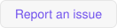
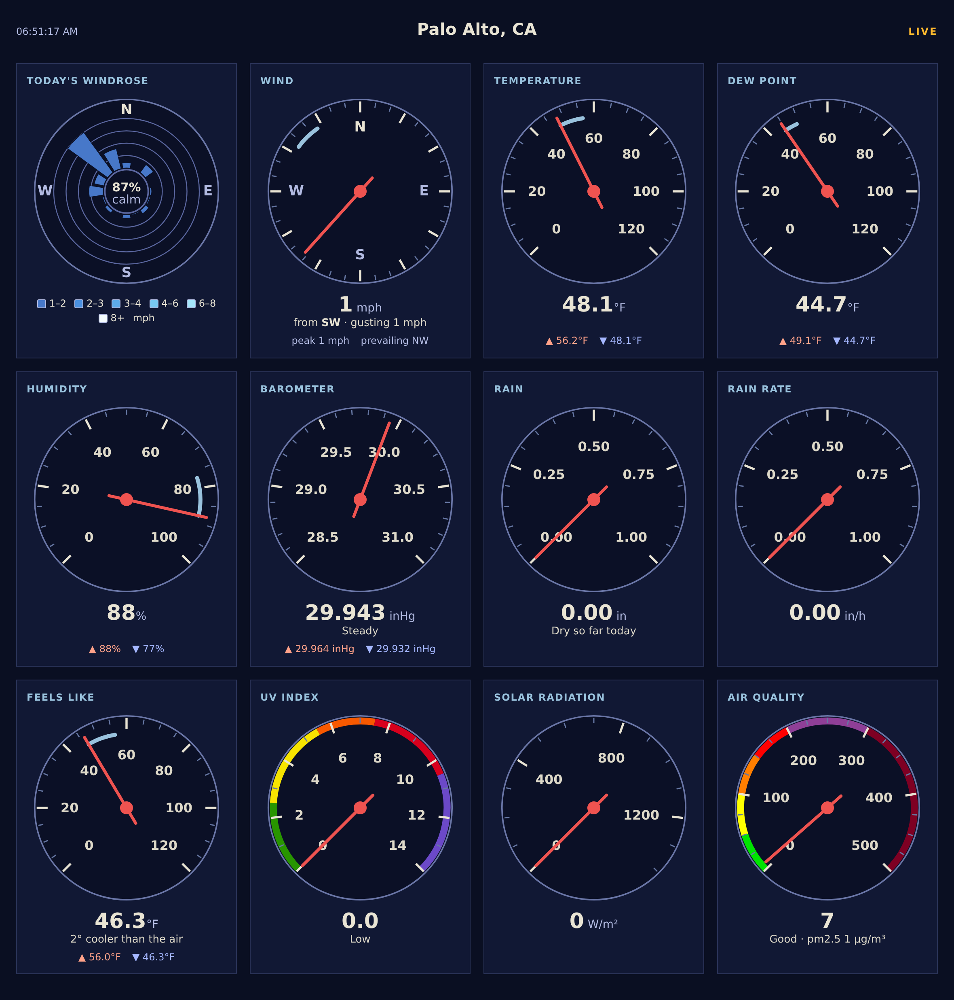
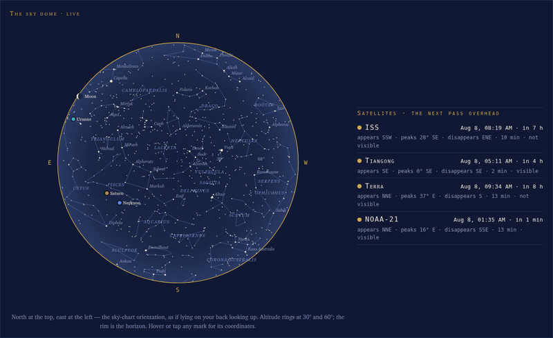
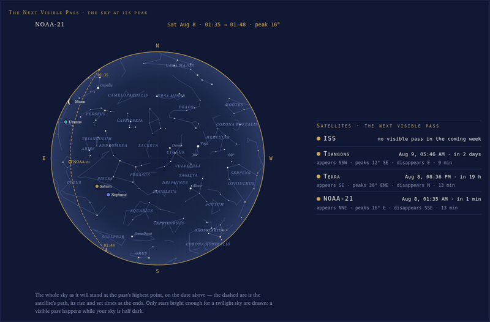

# weewx-loopdata — Make your skins come alive!

[](https://chaunceygardiner.github.io/weewx-loopdata/)
[](https://github.com/chaunceygardiner/weewx-loopdata/releases/latest/download/weewx-loopdata.zip)
[](https://github.com/chaunceygardiner/weewx-loopdata/issues)

Copyright (C)2022-2026 by John A Kline (john@johnkline.com)

**This extension requires Python 3.7 or later and WeeWX 4.6 or later.**

## Description

With LoopData, the tags in your WeeWX reports can be updated on every LOOP
packet — typically every few seconds — instead of waiting for the next archive
interval and page reload.  This works for nearly every tag you would use in a
report: current observations, trends, aggregates over hours, days, weeks,
months, years and rolling windows — including almanac tags, station tags and
unit labels.

This is the sample report included with this extension — a NOAA-style
windrose and eleven gauges, drawn by a few hundred lines of dependency-free
canvas javascript.  Every needle, petal and readout on this page redraws on
every loop packet, and gauges for sensors a station does not have (UV,
solar radiation, air quality) hide themselves automatically:



Here is the whole idea in one example.  Say your report template shows a
current condition, a daily aggregate and an almanac time:

```
Temperature: $current.outTemp
High today: $day.outTemp.max
Sunset: $almanac.sunset
```

Declare those same tags — with the `$` removed — in your skin's
`skin.conf`:

```
[LoopData]
    [[fields]]
        readings = current.outTemp, day.outTemp.max, almanac.sunset
```

Now, on every loop packet, LoopData writes a json file, `loop-data.txt`, with
an entry for your report holding those tags as its keys — and every value
already unit-converted and formatted exactly as your report would render
it:

```json
{"MyReport": {"current.outTemp": "79.2°F", "day.outTemp.max": "85.1°F", "almanac.sunset": "20:32"}}
```

Finally, in the template, wrap each tag in an element whose id is the tag, and
add a few lines of javascript to fill those elements from loop-data.txt:

```html
Temperature: <span id="current.outTemp">$current.outTemp</span><br/>
High today: <span id="day.outTemp.max">$day.outTemp.max</span><br/>
Sunset: <span id="almanac.sunset">$almanac.sunset</span>

#import json
<script>
  async function updateLoopData() {
    const response = await fetch('loop-data.txt', {cache: 'no-store'});
    const data = (await response.json())[$json.dumps($REPORT_NAME)];
    for (const key in data) {
      const element = document.getElementById(key);
      if (element) element.innerHTML = data[key];
    }
  }
  setInterval(updateLoopData, 2000);  // match your loop frequency
</script>
```

The page loads showing the values Cheetah rendered at report time, then comes
alive: every wrapped tag updates as fast as your station reports.  That is
all there is to it.

The [manual](https://chaunceygardiner.github.io/weewx-loopdata/) covers the
rest: the full field grammar, the live windrose, almanac and station fields,
translations, and the recipe for building your own live page.

## What you get

* **Every period a report tag has**, live: `current`, `trend`, `hour`, `day`,
  `week`, `month`, `year`, `rainyear`, `alltime`, plus rolling windows of any
  length from `1m` through `1440m` and `1h` through `24h`.
* **Values formatted as your report would render them** — each report
  declares the fields it needs and gets them in its own units, formats and
  language, so page javascript can drop them straight into HTML.  Any
  field can override the unit (`day.outTemp.avg.degree_C`), round
  (`.round(1)`), or use the report tags' formatting calls.
* **A live NOAA-style windrose** — sixteen compass bins by N speed bands,
  tracking time and distance per cell, for any period except `current` and
  `trend`.
* **Almanac fields** — `almanac.sunrise`, moon phase, planet positions,
  satellite passes: any registered almanac tag, computed live, with caching
  tiers so only values that actually change are recomputed.
* **Station fields** — `$station` tags including a restart-correct live
  uptime.
* **A sample instrument panel** that works out of the box, in nine lang files
  (eight translations plus the English reference dictionary).
* **No third-party Python packages**, and none of the per-packet work on the
  WeeWX engine thread.

## Example of LoopData in Action

See weewx-loopdata in action at
[www.paloaltoweather.com](https://www.paloaltoweather.com/) — the
"LiveSeasons" skin, including its celestial tabs, is loopdata-driven
throughout.

Below, loopdata is driving
[weewx-celestial](https://github.com/chaunceygardiner/weewx-celestial)'s
satellite pages, captured live
from the running page (2-second frames played at about 30&times; speed):
NOAA-21 crosses the Palo Alto sky before dawn on August 15, 2026 —
02:43&rarr;02:58 PDT, peaking 74&deg; in the east-southeast.  Every mark and
number that moves between loop packets arrives through `loop-data.txt`: the
dome places the satellite from per-packet almanac position fields, and the
roster rows are `next_pass` fields.



The satellite rises sunlit at full brass, and mid-pass the dome's marker
flips to a hollow ring as NOAA-21 enters Earth's shadow.  Mars, Saturn,
Uranus and Neptune are up, and all four tracked satellites hold rows
in the roster — NOAA-21's reads "overhead now" for exactly as long as the
pass lasts, then rolls to the following pass the moment this one ends.



The Next Visible Pass panel draws the whole pass at once — the dashed arc is
the satellite's path, with its rise and set times at the ends — while the
sweep mark rides the arc to show where along that path the satellite is
right now.  The sweep mark carries the satellite's live sunlit state as well,
so it hollows out at the same instant the dome's marker does.

This extension was inspired by Gary Roderick's weewx-realtime_gauge_data
extension (its GitHub repository is no longer available).

## Installation

Full instructions, including how to check that the install is running, are on
the manual's
[Installation page](https://chaunceygardiner.github.io/weewx-loopdata/installation.html).
Upgrading an existing install?  Some releases need a change to your
`[LoopData]` section — see
[Upgrading](https://chaunceygardiner.github.io/weewx-loopdata/upgrading.html).

> [!IMPORTANT]
> LoopData is targeted at drivers that report loop packets on a regular
> cadence, with all observations present in every packet.  It has been tested
> with the WeeWX vantage and cc3000 drivers and will likely work with any
> other driver of that kind.  Drivers that report irregularly or send partial
> packets are untested: time-weighted aggregates assume the steady cadence set
> in `[[LoopFrequency]] seconds`.

**WeeWX 5**

1. Download the latest release, [weewx-loopdata.zip](https://github.com/chaunceygardiner/weewx-loopdata/releases/latest/download/weewx-loopdata.zip).

1. Install the extension:

   `weectl extension install weewx-loopdata.zip`

1. Adjust the `[LoopData]` section the install adds to weewx.conf (below).

1. Restart WeeWX.

**WeeWX 4**

Same steps, but install with:

`sudo /home/weewx/bin/wee_extension --install weewx-loopdata.zip`

(This assumes weewx is installed in `/home/weewx`; adjust the path
accordingly.)

**Optional: SSH control master multiplexing.**  This applies only if you rsync
loop-data.txt to another machine.  Rsync'ing every 2 seconds means a few
rsyncs a day will inevitably fail — harmless, but avoidable.  Create a
`.ssh/config` file under the home directory of the user running WeeWX, with
the contents below.  The `Host` entered must match exactly the `remote_server`
value in the `RsyncSpec` section of `[LoopData]` in weewx.conf:

```
Host www.paloaltoweather.com   # <-- CHANGE TO YOUR remote_server!
    ControlMaster auto
    ControlPath ~/.ssh/control-%r@%h:%p
    ControlPersist 10m
    ServerAliveInterval 15
    ServerAliveCountMax 3
```

## Sample configuration

Fresh installs add the following `[LoopData]` section to `weewx.conf`.  Since
6.11.3 each section and option in it arrives with a comment saying what it is
for; the block below strips those prose comments, so it is the values a fresh
install writes, not the shape of the text.  The `#` marks are not prose,
though, and are shown: an option that only selects a default now arrives
commented out, so that the value LoopData itself supplies — including a better
one a later release may bring — is the one that applies.  (A station installed
before that change has all eight `[[RsyncSpec]]` options as live settings,
with the same values, and nothing about it changes.)  There is no fields line: since 7.0
each report declares the fields it needs in its own `skin.conf` — the sample
report's declares its panel's — see
[Declaring fields](https://chaunceygardiner.github.io/weewx-loopdata/declaring-fields.html).
Upgrading installs keep whatever `[[Include]]` fields line and
`[[Formatting]]` target_report are already in `weewx.conf`, and those keep
working as before.

```
[LoopData]
    [[FileSpec]]
        loop_data_dir = .
        filename = loop-data.txt
    [[LoopFrequency]]
        seconds = 2.0
    [[RsyncSpec]]
        enable = false
        #compress = false
        #log_success = false
        #timeout = 1
        #skip_if_older_than = 3
        remote_server = www.foobar.com
        remote_user = root
        remote_dir = /home/weewx/loop-data
```

## Entries in `LoopData` sections of `weewx.conf`:
 * `loop_data_dir`     : The directory into which the loop data file should be written.
                         If a relative path is specified, it is relative to the
                         sample report's directory (`LoopDataReport`, or the report named
                         by `target_report` if you set one).  The default (inside your reports
                         tree) works and is what most stations use; if you are
                         comfortable editing your web server's configuration, see
                         [Where the loop-data file should
                         live](https://chaunceygardiner.github.io/weewx-loopdata/configuration.html#where-the-loop-data-file-should-live)
                         for a tidier arrangement — the file on a memory filesystem
                         outside the web root, which keeps it out of your report sync
                         and off an SD card.
 * `filename`          : The name of the loop data file to write.
 * `seconds`           : How often your station emits loop packets.  LoopData weights
                         its accumulator entries with it, and gives each packet an
                         `interval` of `seconds / 60`.  Get it right.  `2.0` is the
                         shipped default and is right for a Davis Vantage; other
                         drivers vary, and if yours has a polling interval you set,
                         use that number.  Periods that outlive weewxd's startup are
                         seeded from your database at the archive's own weights, so a
                         wrong value skews the weighted averages until that period
                         rolls over; `windrun` and `windrose` are wind speed times this
                         interval and never recover, scaling directly with the error.
 * `enable`            : Set to true to rsync the loop data file to `remote_server`.
 * `remote_server`     : The server to which the loop data file will be copied.
                         To use rsync to sync loop-data.txt to a remote computer, passwordless ssh
                         using public/private key must be configured for authentication from the user
                         account that weewx runs under on this computer to the user account on the
                         remote machine with write access to the destination directory (remote_dir).
 * `remote_port`       : The ssh port on remote_server, if it is not the default 22.  Unset
                         by default, in which case ssh's own default applies.  (A port set
                         here and a port set in `ssh_options` are two ways to the same end;
                         pick one.)
 * `remote_user`       : The userid on remote_server with write permission to remote_dir.
 * `remote_dir`        : The directory on remote_server where filename will be copied.
 * `compress`          : True to compress the file before sending.  Default is False.
 * `log_success`       : True to write success with timing messages to the log (for debugging).
                         Default is False.
 * `ssh_options`       : Extra options for the ssh transport (e.g., a key file or port).
                         Whether or not this is set, LoopData appends safety bounds for any
                         keyword you don't set yourself: `-o ConnectTimeout=<timeout>`,
                         `-o ServerAliveInterval=<timeout>`, `-o ServerAliveCountMax=2` and
                         `-o BatchMode=yes`, so a dead or hanging remote cannot stall the
                         loop processing thread (an option you set always wins).
 * `timeout`           : I/O timeout. Default is 1.  (When sending, timeout in 1 second.)
                         Also used for the ssh ConnectTimeout and ServerAliveInterval
                         bounds described under `ssh_options`.  0 disables all time bounds.
 * `skip_if_older_than`: Don't bother to rsync if greater than this number of seconds.  Default is 3.
                         (Skip this and move on to the next if this data is older than 3 seconds.)

Deprecated, still honored on an upgraded station, not written by a fresh
install:

 * `target_report`     : The report the old station-wide `fields` line is rendered
                         through -- its units, formatting and language -- and the
                         report whose directory a relative `loop_data_dir` is relative
                         to.  `LoopDataReport`, the sample report, when absent.
 * `fields`            : The old station-wide list of fields, written as flat keys at
                         the top level of the file.  Reports declare their own fields
                         now; do not edit this line by hand -- a later release removes
                         it once every extension that used it declares its fields.
 * `windrose_bands`    : Pre-7.0 spelling of the `windrose` band edges, in
                         `target_report`'s windSpeed unit; it bands that report's rose
                         and no other's, as it did before 7.0.  Since 7.0
                         `windrose_bands` is a report option: on a report's stanza in
                         `[StdReport]` (in that report's unit) or under
                         `[StdReport] [[Defaults]]` for every report -- see
                         [Declaring fields](https://chaunceygardiner.github.io/weewx-loopdata/declaring-fields.html#windrose_bands-per-report).
                         Note this one sits directly under `[LoopData]`, not in a
                         sub-section.

## Where to find things

Everything below is in the
[manual](https://chaunceygardiner.github.io/weewx-loopdata/), which has search:

| If you want to | See |
|---|---|
| Install, and check that it is running | [Installation](https://chaunceygardiner.github.io/weewx-loopdata/installation.html) |
| Upgrade an existing install | [Upgrading](https://chaunceygardiner.github.io/weewx-loopdata/upgrading.html) |
| Understand a `[LoopData]` option | [Configuration](https://chaunceygardiner.github.io/weewx-loopdata/configuration.html) |
| Know what a field may look like — periods, aggregates, units, `round(n)`, format specs | [Field reference](https://chaunceygardiner.github.io/weewx-loopdata/field-reference.html) |
| Build a live windrose, or tune its speed bands | [The live windrose](https://chaunceygardiner.github.io/weewx-loopdata/windrose.html) |
| Publish sunrise, moon phase, planet positions or satellite passes | [Almanac fields](https://chaunceygardiner.github.io/weewx-loopdata/almanac-fields.html) |
| Publish `$station` tags, including a live uptime | [Station fields](https://chaunceygardiner.github.io/weewx-loopdata/station-fields.html) |
| Declare the fields a report needs | [Declaring fields](https://chaunceygardiner.github.io/weewx-loopdata/declaring-fields.html) |
| Feed a script, an SNMP check or anything that isn't a page | [Fields for scripts](https://chaunceygardiner.github.io/weewx-loopdata/declaring-fields.html#fields-for-scripts-and-other-non-report-consumers) |
| Use LoopData in your own skin | [Building a live page](https://chaunceygardiner.github.io/weewx-loopdata/build-a-live-page.html) |
| Know what the sample panel does, or crib from it | [The sample skin](https://chaunceygardiner.github.io/weewx-loopdata/sample-skin.html) |
| Read the page in another language | [Translations](https://chaunceygardiner.github.io/weewx-loopdata/i18n.html) |
| Push loop-data.txt to a remote server | [Syncing to a remote server](https://chaunceygardiner.github.io/weewx-loopdata/rsync.html) |
| Know what it costs, and how it works | [How LoopData works](https://chaunceygardiner.github.io/weewx-loopdata/how-it-works.html) |
| Fix something that is not working | [Troubleshooting](https://chaunceygardiner.github.io/weewx-loopdata/troubleshooting.html) |

What changed in each version is on the
[releases page](https://github.com/chaunceygardiner/weewx-loopdata/releases).

## Testing

The test suite is plain `unittest` and must be run from the repository root
(the tests load config fixtures by relative path), with a Python that has
WeeWX installed:

```
PYTHONPATH=bin:tests python tests/test_process_packet.py
```

## Why require Python 3.7 or later?

LoopData code includes type annotations which do not work with Python 2, nor in
earlier versions of Python 3.

## Licensing

weewx-loopdata is licensed under the GNU Public License v3.
