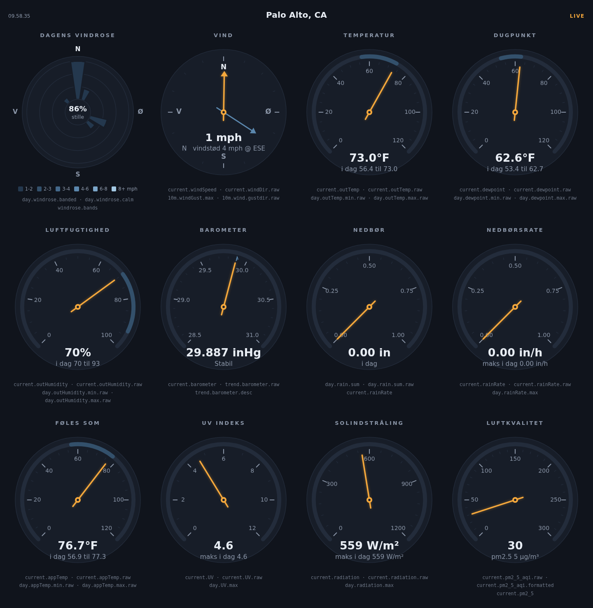

# Translating the sample report

[weewx-loopdata manual](https://chaunceygardiner.github.io/weewx-loopdata/) · [weewx-loopdata on GitHub](https://github.com/chaunceygardiner/weewx-loopdata) · [Report an issue](https://github.com/chaunceygardiner/weewx-loopdata/issues)

---

As of 6.4 the sample report is translatable, entirely through WeeWX's own
mechanisms — lang files, `[Texts]`/`$gettext`, and the `[Almanac]` section.
There are no invented conventions to learn: if you have translated a WeeWX
skin before, this works the same way.  (Language support needs WeeWX 4.6
or later.)

**Eight complete translations ship with the skin**, in `skins/LoopData/lang/`.
Every one covers the whole report; Beta means it has not yet been read by a
native speaker, not that it is partial — corrections are welcome either way.

| Language | File | Status |
|---|---|---|
| Danish | `lang/da.conf` | Reviewed — contributed by native speaker Gert Andersen |
| German | `lang/de.conf` | Beta — its shared vocabulary is reviewed, this skin's own strings are not |
| French | `lang/fr.conf` | Beta — its shared vocabulary is reviewed, this skin's own strings are not |
| Spanish | `lang/es.conf` | Beta |
| Italian | `lang/it.conf` | Beta |
| Dutch | `lang/nl.conf` | Beta |
| Norwegian (Bokmål) | `lang/no.conf` | Beta |
| Swedish | `lang/sv.conf` | Beta |

A ninth file, `lang/en.conf`, is the English reference dictionary rather than
a translation — it is what you copy to start a new language.  The vocabulary
these files share with
[weewx-skyfield](https://github.com/chaunceygardiner/weewx-skyfield) and
[weewx-celestial](https://github.com/chaunceygardiner/weewx-celestial) is
copied verbatim from theirs, and a test keeps the three extensions in step.

Select one in `weewx.conf`:

```ini
[StdReport]
    [[LoopDataReport]]
        lang = da
```

The sample report in Danish — gauge headings, readouts, the LIVE badge and
the compass letters all come from `lang/da.conf`:



## Two languages meet on the page

This is the one thing unique to a loopdata page, so it comes first: the
sample report mixes two sources with **independent language settings**.

1. **The page's own labels** — the gauge headings, the LIVE badge, the
   readout lines under the dials — follow the *sample report's* `lang`,
   via its lang files, as on any WeeWX skin.
2. **The live values** in `loop-data.txt` follow the language of
   loopdata's **`[LoopData]` target report**: loopdata renders every field
   with the target report's formatter and texts, so `.ordinal_compass`
   fields take that report's compass ordinates, `moon_phase` its
   `moon_phases`, and `almanac.<body>.label` /
   `almanac.<body>.constellation.label` its `[Almanac]` names — one
   language per loopdata instance, regardless of which page displays them.

Out of the box the two are the same report (`target_report =
LoopDataReport`), so `lang = de` on `[[LoopDataReport]]` switches labels
and values together, and the shipped lang files carry the value-side
sections (compass ordinates, moon phases, body and all 88 constellation
names, hemisphere letters) so a German target report serves German values.

If your target report is a *different* report (say, Seasons), a coherent
German page needs both: `lang = de` on the sample report's stanza *and* a
German target report.  The simplest route sets every report at once:

```ini
[StdReport]
    [[Defaults]]
        lang = de
```

A skin with no German lang file simply stays English — a missing language
is a logged no-op, never an error.

`trend.barometer.desc` follows the same rule: each English description
(`Falling Slowly`, `Steady`, …) is a gettext-style key into the *target
report's* `[Texts]`, the shipped lang files carry all nine, and a missing
key falls back to the English.  (Before 6.4 these came from a `[LoopData]`
`[[BarometerTrendDescriptions]]` section in `weewx.conf`; that section is
gone and now ignored — delete it, and put any custom wording in the target
report's `[[[Texts]]]` instead.)

## How it works

Every string the page renders is a **gettext-style `[Texts]` key: the
English string is the key**.  A report falls back to English one string at
a time, so a partial translation is fine — a missing key never blanks a
gauge, it just renders in English.

The live javascript composes strings too (the badge, the readout lines,
the cardinal letters on the wind dial and windrose).  Those are translated
at generation time and fed to the script as globals through `json.dumps`,
so translations need nothing beyond the lang file — there are no strings
to edit in the javascript.

## Adding a language

The reference dictionary is `skins/LoopData/lang/en.conf` — every string
the page renders, and nothing else (a test keeps it exact in both
directions).  To add a language:

1. Copy `en.conf` to `<code>.conf` in the same `lang` directory (e.g.
   `fr.conf`) and translate the values — the keys stay English.
   Translate as much or as little as you like; anything you drop falls
   back to English per string.
2. Point the report at it in `weewx.conf`:

```ini
[StdReport]
    [[LoopDataReport]]
        lang = fr
```

Composed strings keep their `{named}` placeholders — reorder them freely,
but do not rename them (a broken placeholder makes that one string fall
back to English).  For example:

```ini
[Texts]
    "today {min} to {max}" = "heute {min} bis {max}"
```

Note that `weectl extension install` overwrites `skins/LoopData/` —
including its lang files — on every upgrade.  A new language is durable as
a pull request (welcome — a lang file is a self-contained, no-code
contribution), or keep your own copy elsewhere and re-copy it after
upgrades; local *overrides* of shipped strings survive upgrades as
`[[[Texts]]]` entries on the report's stanza in `weewx.conf`.
