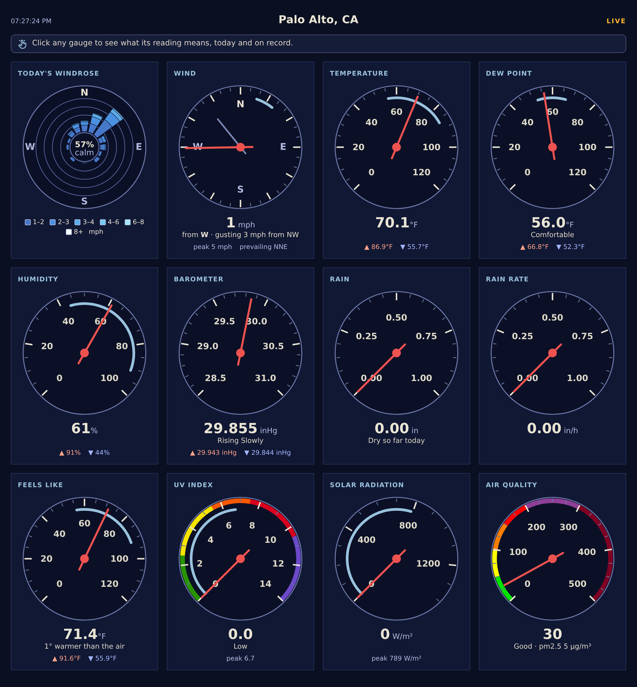
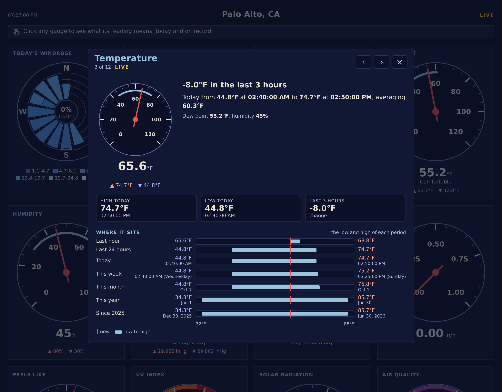
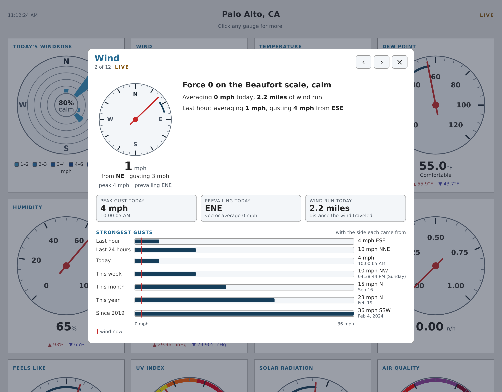
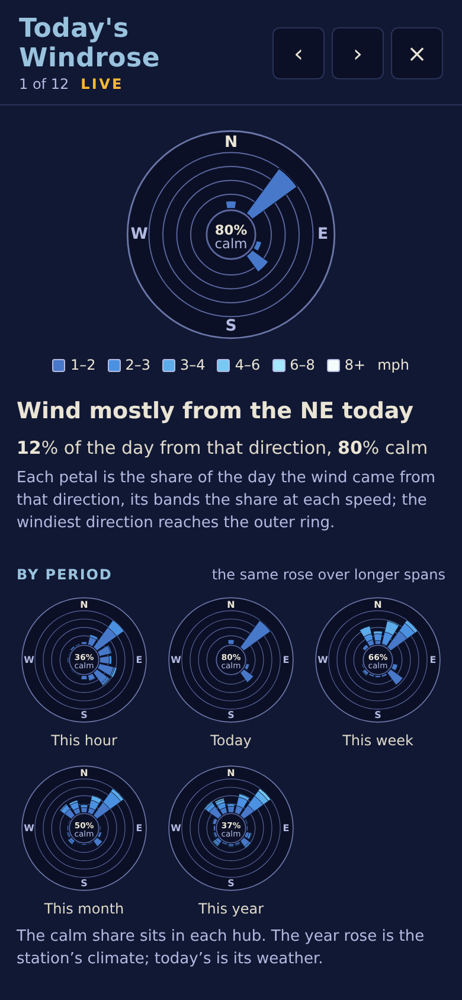

# The sample skin

[weewx-loopdata manual](https://chaunceygardiner.github.io/weewx-loopdata/) · [weewx-loopdata on GitHub](https://github.com/chaunceygardiner/weewx-loopdata) · [Report an issue](https://github.com/chaunceygardiner/weewx-loopdata/issues)

---

A sample skin (`skins/LoopData`, registered as the report `LoopDataReport`)
is included with the extension.  After installing and restarting, and after
waiting for a report cycle, it can be found at `<weewx-url>/loopdata/`.
The skin declares the fields the panel reads in its own `skin.conf`, so
the panel works out of the box on a fresh install.



## The instrument panel

The page is a NOAA windrose, a wind compass and ten dials, drawn as SVG
by a few hundred lines of dependency-free javascript — and every needle,
petal and reading redraws on every loop packet.  Each instrument is a card:
the drawing, then under it the reading, a line saying what it means, and
today's high above its low.

* Temperature, dew point, feels-like and humidity dials draw today's
  low-to-high as an arc inside the ticks.  Feels like says how far it is
  from the air temperature.
* The wind compass points the dials' red arm at the side the wind comes
  from, with a lighter, shorter needle for the strongest gust of the last
  ten minutes, and today's prevailing direction as a short arc.  Under it:
  "from WNW · gusting 14 mph from W", today's peak and the prevailing
  direction in words.
* The barometer draws the 3-hour trend as an arc, headed in the direction
  of travel, once the change is big enough to draw — about 1.3 hPa
  (0.04 inHg) — and says it in words (`trend.barometer.desc`) either
  way.
* UV and air quality wear their EPA category colors on the rim, and say
  the category: "High" at a UV index of 6, "Good" at an AQI of 38.  EPA
  names the UV index rounded, so the page does too.  The air quality dial
  runs to 500, the top of EPA's Hazardous band.
* UV, solar radiation and rain rate draw today's peak as an arc from the
  floor.  Rain and rain-rate dials rescale themselves on a big day.
* The windrose is the NOAA banded kind, drawn from `day.windrose.banded`
  and `day.windrose.calm`.
* UV, solar radiation and air quality (weewx-purple's `pm2_5_aqi`) gauges —
  and the feels-like dial where appTemp is not computed — hide themselves
  when the station doesn't report the observation, and reappear if the
  field shows up in loop-data.txt.

The division of labor is the loopdata pattern in miniature: the `.raw`
fields drive the geometry, `.formatted` fields supply each number and
`unit.label` fields the unit beside it and the dial scales — so the panel
follows this report's units and formatting (metric or US, and its decimal
point) like any other loopdata page.  The numerals on the dials use the
same decimal point.  The panel scales with the window: four cards to a
row, three below 1080 pixels, two below 800 and one below 540.  Each
drawing is a square stretched to its card, so its lines and words grow
together (drawings cap at 480px), and the words under it grow with the
card.  Every gauge's face, the windrose's included, comes out the same
size.

The fields the panel reads are declared in `skins/LoopData/skin.conf`,
one group per gauge (see [Declaring fields](declaring-fields.html)), and
the page reads its own report's entry in `loop-data.txt` — so it works
whatever else the file carries, and a second copy of the skin under
another report name gets its own entry.

## The cards

Since 8.0 every gauge opens a card.  Click or tap a gauge (the drawing
is the keyboard target: Tab to it and press Enter) and a card opens over
the panel — a full-screen sheet on a phone — with the dial and its lines
at the left and, beside them, what the reading means and where it sits.
The card follows the station like the panel does: everything on it is
rewritten on every packet while it is open, from the same
`loop-data.txt` poll.  The ‹ › buttons in its head, or the arrow keys,
step through the gauges; Escape, the × or a click outside closes it.



Each card is the same four things:

* **A sentence** that says the one thing the gauge means now: the change
  over the report's trend window, the Beaufort force and its name, the
  dew point in words (dry, comfortable, sticky, muggy, oppressive), the
  sun's altitude and when it sets (the altitude on WeeWX 5.0 and later;
  at high latitudes, that the sun does not set or does not rise today,
  or that civil twilight lasts all night, and the Sun up tile reads
  "all day" or "not today"), the AMS Glossary's word for how hard it is
  raining.  A fine-print line explains the measure once.
* **Three tiles**: today's high and low with their times, and the change
  over the trend window — or, where those do not apply, the peak, the
  wind run, the rain year.
* **The ladder**: one row per period — the last hour, the last 24 hours,
  today, this week, this month, this year and all time — each a bar from
  the period's low to its high on one axis, with the reading now drawn as
  a line through every row and the time or date of each extreme under
  it.  The all-time row is the station's records, with their dates, and
  is labeled by the year the archive begins.  For a peak-only measure
  (UV, solar radiation, rain rate, the strongest gusts, rain by period)
  every bar runs from zero, and the UV and air quality bars wear EPA's
  category colors.
* **One more section where there is one**: the windrose card draws the
  rose for this hour, today, this week, this month and this year; the UV
  and air quality cards show EPA's scale with the reading's row marked.
  The air quality card's today tiles and its ladder rank each period's
  highest (and today's lowest) PM2.5, which is archived, and show it as
  the index weewx-purple computes for it; the index itself is an xtype,
  computed per packet and never archived, so loopdata refuses its
  aggregates for every period, today included.  Only the reading now uses
  the index in the packet.



On a phone the card is a full-screen sheet:



Day and week times on a card render through the report's own
`[Units][TimeFormats]`, as the panel's do; the month, year and all-time
extremes carry a date, in the two forms the skin declares.  All of it is
translated in the eight shipped languages, by the same mechanism as the
panel (see [Translations](#translations)); the card strings arrived with
8.0 and have not yet been reviewed by native speakers.

The cards cost the LoopData service something: each period a card ranks
a reading against is an accumulator, and the rolling 24-hour windows
keep every packet of the last day — about 10 MB each at two-second
packets, some 80 MB for the nine observations the cards rank.  The
fields, one `_card` group per card, are listed below; a station that
does not want the cost can delete a group from the declaration (in a
copy of the report's stanza in `weewx.conf`, since `skin.conf` is
replaced on upgrade), and the card then says what the fields that
remain can say.

## What each gauge reads

Gauge by gauge, in the order the page lays them out.  A gauge whose
formatted field is missing shows `--`; one whose `.raw` field is missing
draws no needle, arc or petal.

| Gauge | Fields |
|:--|:--|
| Today's Windrose | `day.windrose.banded`, `day.windrose.calm` (and the automatic `windrose.bands`) |
| Wind | `current.windSpeed.formatted`, `current.windSpeed.raw`, `current.windDir.raw`, `current.windDir.ordinal_compass`, `10m.windGust.max`, `10m.windGust.max.raw`, `10m.wind.gustdir.raw`, `10m.wind.gustdir.ordinal_compass`, `day.wind.max`, `day.wind.max.raw`, `day.wind.vecdir.raw`, `day.wind.vecdir.ordinal_compass` |
| Temperature | `current.outTemp.formatted`, `current.outTemp.raw`, `day.outTemp.min.raw`, `day.outTemp.max.raw`, `day.outTemp.min.formatted`, `day.outTemp.max.formatted` |
| Dew Point | `current.dewpoint.formatted`, `current.dewpoint.raw`, `day.dewpoint.min.raw`, `day.dewpoint.max.raw`, `day.dewpoint.min.formatted`, `day.dewpoint.max.formatted` |
| Humidity | `current.outHumidity.formatted`, `current.outHumidity.raw`, `day.outHumidity.min.raw`, `day.outHumidity.max.raw`, `day.outHumidity.min.formatted`, `day.outHumidity.max.formatted` |
| Barometer | `current.barometer.formatted`, `current.barometer.raw`, `trend.barometer.raw`, `trend.barometer.desc`, `day.barometer.min.formatted`, `day.barometer.max.formatted` |
| Rain | `day.rain.sum.formatted`, `day.rain.sum.raw`, `current.rainRate`, `current.rainRate.raw` |
| Rain Rate | `current.rainRate.formatted`, `current.rainRate.raw`, `day.rainRate.max`, `day.rainRate.max.raw` |
| Feels Like | `current.appTemp.formatted`, `current.appTemp.raw`, `day.appTemp.min.raw`, `day.appTemp.max.raw`, `day.appTemp.min.formatted`, `day.appTemp.max.formatted` |
| UV Index | `current.UV.formatted`, `current.UV.raw`, `day.UV.max`, `day.UV.max.raw` |
| Solar Radiation | `current.radiation.formatted`, `current.radiation.raw`, `day.radiation.max`, `day.radiation.max.raw` |
| Air Quality | `current.pm2_5`, `current.pm2_5_aqi.raw`, `current.pm2_5_aqi.formatted` |
| Today's Windrose card | `hour.windrose.banded`, `hour.windrose.calm`, `week.windrose.banded`, `week.windrose.calm`, `month.windrose.banded`, `month.windrose.calm`, `year.windrose.banded`, `year.windrose.calm` |
| Wind card | `day.windSpeed.avg`, `day.windrun.sum`, `day.wind.vecavg`, `day.wind.maxtime`, `day.wind.gustdir.ordinal_compass`, `1h.windSpeed.avg`, `1h.windGust.max`, `1h.windGust.max.raw`, `1h.wind.gustdir.ordinal_compass`, `24h.windGust.max`, `24h.windGust.max.raw`, `24h.wind.gustdir.ordinal_compass`, `week.wind.max`, `week.wind.max.raw`, `week.wind.gustdir.ordinal_compass`, `week.wind.maxtime`, `month.wind.max`, `month.wind.max.raw`, `month.wind.gustdir.ordinal_compass`, `month.wind.maxtime.format("%b %-d")`, `year.wind.max`, `year.wind.max.raw`, `year.wind.gustdir.ordinal_compass`, `year.wind.maxtime.format("%b %-d")`, `alltime.wind.max`, `alltime.wind.max.raw`, `alltime.wind.gustdir.ordinal_compass`, `alltime.wind.maxtime.format("%b %-d, %Y")`, `alltime.start.format("%Y")` |
| Temperature card | `trend.outTemp.formatted`, `day.outTemp.avg.formatted`, `1h.outTemp.min.raw`, `1h.outTemp.min.formatted`, `1h.outTemp.max.raw`, `1h.outTemp.max.formatted`, `24h.outTemp.min.raw`, `24h.outTemp.min.formatted`, `24h.outTemp.max.raw`, `24h.outTemp.max.formatted`, `day.outTemp.min.raw`, `day.outTemp.min.formatted`, `day.outTemp.mintime`, `day.outTemp.max.raw`, `day.outTemp.max.formatted`, `day.outTemp.maxtime`, `week.outTemp.min.raw`, `week.outTemp.min.formatted`, `week.outTemp.mintime`, `week.outTemp.max.raw`, `week.outTemp.max.formatted`, `week.outTemp.maxtime`, `month.outTemp.min.raw`, `month.outTemp.min.formatted`, `month.outTemp.mintime.format("%b %-d")`, `month.outTemp.max.raw`, `month.outTemp.max.formatted`, `month.outTemp.maxtime.format("%b %-d")`, `year.outTemp.min.raw`, `year.outTemp.min.formatted`, `year.outTemp.mintime.format("%b %-d")`, `year.outTemp.max.raw`, `year.outTemp.max.formatted`, `year.outTemp.maxtime.format("%b %-d")`, `alltime.outTemp.min.raw`, `alltime.outTemp.min.formatted`, `alltime.outTemp.mintime.format("%b %-d, %Y")`, `alltime.outTemp.max.raw`, `alltime.outTemp.max.formatted`, `alltime.outTemp.maxtime.format("%b %-d, %Y")` |
| Dew Point card | `trend.dewpoint.formatted`, `1h.dewpoint.min.raw`, `1h.dewpoint.min.formatted`, `1h.dewpoint.max.raw`, `1h.dewpoint.max.formatted`, `24h.dewpoint.min.raw`, `24h.dewpoint.min.formatted`, `24h.dewpoint.max.raw`, `24h.dewpoint.max.formatted`, `day.dewpoint.min.raw`, `day.dewpoint.min.formatted`, `day.dewpoint.mintime`, `day.dewpoint.max.raw`, `day.dewpoint.max.formatted`, `day.dewpoint.maxtime`, `week.dewpoint.min.raw`, `week.dewpoint.min.formatted`, `week.dewpoint.mintime`, `week.dewpoint.max.raw`, `week.dewpoint.max.formatted`, `week.dewpoint.maxtime`, `month.dewpoint.min.raw`, `month.dewpoint.min.formatted`, `month.dewpoint.mintime.format("%b %-d")`, `month.dewpoint.max.raw`, `month.dewpoint.max.formatted`, `month.dewpoint.maxtime.format("%b %-d")`, `year.dewpoint.min.raw`, `year.dewpoint.min.formatted`, `year.dewpoint.mintime.format("%b %-d")`, `year.dewpoint.max.raw`, `year.dewpoint.max.formatted`, `year.dewpoint.maxtime.format("%b %-d")`, `alltime.dewpoint.min.raw`, `alltime.dewpoint.min.formatted`, `alltime.dewpoint.mintime.format("%b %-d, %Y")`, `alltime.dewpoint.max.raw`, `alltime.dewpoint.max.formatted`, `alltime.dewpoint.maxtime.format("%b %-d, %Y")` |
| Humidity card | `trend.outHumidity.formatted`, `1h.outHumidity.min.raw`, `1h.outHumidity.min.formatted`, `1h.outHumidity.max.raw`, `1h.outHumidity.max.formatted`, `24h.outHumidity.min.raw`, `24h.outHumidity.min.formatted`, `24h.outHumidity.max.raw`, `24h.outHumidity.max.formatted`, `day.outHumidity.min.raw`, `day.outHumidity.min.formatted`, `day.outHumidity.mintime`, `day.outHumidity.max.raw`, `day.outHumidity.max.formatted`, `day.outHumidity.maxtime`, `week.outHumidity.min.raw`, `week.outHumidity.min.formatted`, `week.outHumidity.mintime`, `week.outHumidity.max.raw`, `week.outHumidity.max.formatted`, `week.outHumidity.maxtime`, `month.outHumidity.min.raw`, `month.outHumidity.min.formatted`, `month.outHumidity.mintime.format("%b %-d")`, `month.outHumidity.max.raw`, `month.outHumidity.max.formatted`, `month.outHumidity.maxtime.format("%b %-d")`, `year.outHumidity.min.raw`, `year.outHumidity.min.formatted`, `year.outHumidity.mintime.format("%b %-d")`, `year.outHumidity.max.raw`, `year.outHumidity.max.formatted`, `year.outHumidity.maxtime.format("%b %-d")`, `alltime.outHumidity.min.raw`, `alltime.outHumidity.min.formatted`, `alltime.outHumidity.mintime.format("%b %-d, %Y")`, `alltime.outHumidity.max.raw`, `alltime.outHumidity.max.formatted`, `alltime.outHumidity.maxtime.format("%b %-d, %Y")` |
| Barometer card | `trend.barometer.formatted`, `1h.barometer.min.raw`, `1h.barometer.min.formatted`, `1h.barometer.max.raw`, `1h.barometer.max.formatted`, `24h.barometer.min.raw`, `24h.barometer.min.formatted`, `24h.barometer.max.raw`, `24h.barometer.max.formatted`, `day.barometer.min.raw`, `day.barometer.min.formatted`, `day.barometer.mintime`, `day.barometer.max.raw`, `day.barometer.max.formatted`, `day.barometer.maxtime`, `week.barometer.min.raw`, `week.barometer.min.formatted`, `week.barometer.mintime`, `week.barometer.max.raw`, `week.barometer.max.formatted`, `week.barometer.maxtime`, `month.barometer.min.raw`, `month.barometer.min.formatted`, `month.barometer.mintime.format("%b %-d")`, `month.barometer.max.raw`, `month.barometer.max.formatted`, `month.barometer.maxtime.format("%b %-d")`, `year.barometer.min.raw`, `year.barometer.min.formatted`, `year.barometer.mintime.format("%b %-d")`, `year.barometer.max.raw`, `year.barometer.max.formatted`, `year.barometer.maxtime.format("%b %-d")`, `alltime.barometer.min.raw`, `alltime.barometer.min.formatted`, `alltime.barometer.mintime.format("%b %-d, %Y")`, `alltime.barometer.max.raw`, `alltime.barometer.max.formatted`, `alltime.barometer.maxtime.format("%b %-d, %Y")` |
| Rain card | `1h.rain.sum`, `1h.rain.sum.raw`, `24h.rain.sum`, `24h.rain.sum.raw`, `day.rain.sum`, `week.rain.sum`, `week.rain.sum.raw`, `month.rain.sum`, `month.rain.sum.raw`, `year.rain.sum`, `year.rain.sum.raw`, `rainyear.rain.sum`, `rainyear.rain.sum.raw`, `rainyear.start.format("%b %-d")`, `alltime.rain.sum`, `alltime.start.format("%Y")` |
| Rain Rate card | `day.rainRate.maxtime`, `month.rainRate.max`, `month.rainRate.max.raw`, `month.rainRate.maxtime.format("%b %-d")`, `year.rainRate.max`, `year.rainRate.max.raw`, `year.rainRate.maxtime.format("%b %-d")`, `alltime.rainRate.max`, `alltime.rainRate.max.raw`, `alltime.rainRate.maxtime.format("%b %-d, %Y")` |
| Feels Like card | `trend.appTemp.formatted`, `1h.appTemp.min.raw`, `1h.appTemp.min.formatted`, `1h.appTemp.max.raw`, `1h.appTemp.max.formatted`, `24h.appTemp.min.raw`, `24h.appTemp.min.formatted`, `24h.appTemp.max.raw`, `24h.appTemp.max.formatted`, `day.appTemp.min.raw`, `day.appTemp.min.formatted`, `day.appTemp.mintime`, `day.appTemp.max.raw`, `day.appTemp.max.formatted`, `day.appTemp.maxtime`, `week.appTemp.min.raw`, `week.appTemp.min.formatted`, `week.appTemp.mintime`, `week.appTemp.max.raw`, `week.appTemp.max.formatted`, `week.appTemp.maxtime`, `month.appTemp.min.raw`, `month.appTemp.min.formatted`, `month.appTemp.mintime.format("%b %-d")`, `month.appTemp.max.raw`, `month.appTemp.max.formatted`, `month.appTemp.maxtime.format("%b %-d")`, `year.appTemp.min.raw`, `year.appTemp.min.formatted`, `year.appTemp.mintime.format("%b %-d")`, `year.appTemp.max.raw`, `year.appTemp.max.formatted`, `year.appTemp.maxtime.format("%b %-d")`, `alltime.appTemp.min.raw`, `alltime.appTemp.min.formatted`, `alltime.appTemp.mintime.format("%b %-d, %Y")`, `alltime.appTemp.max.raw`, `alltime.appTemp.max.formatted`, `alltime.appTemp.maxtime.format("%b %-d, %Y")` |
| UV Index card | `day.UV.maxtime`, `1h.UV.avg.formatted`, `almanac.sun.altitude`, `almanac.sun.transit`, `almanac.sunrise`, `almanac.sunrise.raw`, `almanac.sunset`, `almanac.sunset.raw`, `almanac.sun.visible.long_form()`, `almanac.sun.visible.second.raw`, `week.UV.max`, `week.UV.max.raw`, `week.UV.maxtime`, `month.UV.max`, `month.UV.max.raw`, `month.UV.maxtime.format("%b %-d")`, `year.UV.max`, `year.UV.max.raw`, `year.UV.maxtime.format("%b %-d")`, `alltime.UV.max`, `alltime.UV.max.raw`, `alltime.UV.maxtime.format("%b %-d, %Y")` |
| Solar Radiation card | `day.radiation.maxtime`, `1h.radiation.avg`, `almanac.sun.azimuth`, `almanac(horizon=-6).sun(use_center=1).set`, `almanac(horizon=-6).sun(use_center=1).set.raw`, `almanac.sun.visible_change.minute.raw`, `week.radiation.max`, `week.radiation.max.raw`, `week.radiation.maxtime`, `month.radiation.max`, `month.radiation.max.raw`, `month.radiation.maxtime.format("%b %-d")`, `year.radiation.max`, `year.radiation.max.raw`, `year.radiation.maxtime.format("%b %-d")`, `alltime.radiation.max`, `alltime.radiation.max.raw`, `alltime.radiation.maxtime.format("%b %-d, %Y")` |
| Air Quality card | `1h.pm2_5.avg`, `24h.pm2_5.avg`, `24h.pm2_5.max.raw`, `day.pm2_5.min.raw`, `day.pm2_5.mintime`, `day.pm2_5.max.raw`, `day.pm2_5.maxtime`, `week.pm2_5.max.raw`, `week.pm2_5.maxtime`, `month.pm2_5.max.raw`, `month.pm2_5.maxtime.format("%b %-d")`, `year.pm2_5.max.raw`, `year.pm2_5.maxtime.format("%b %-d")`, `alltime.pm2_5.max.raw`, `alltime.pm2_5.maxtime.format("%b %-d, %Y")` |

The card rows are the groups 8.0 added, one per card, on top of the
gauge's own; a card also reads its gauge's fields.  Each card's page
lines are the panel's, copied.

`current.dateTime.raw` drives the timestamp and the LIVE indicator.
`unit.label.outTemp`, `unit.label.outHumidity`, `unit.label.barometer`,
`unit.label.rain`, `unit.label.rainRate`, `unit.label.windSpeed` and
`unit.label.radiation` supply the unit beside each reading and pick the
dial scales.

{: .note }
To turn the sample page off, set `enable = false` on `[[LoopDataReport]]`
rather than deleting or renaming the section: a relative `loop_data_dir`
is measured from its directory, and the installer would put the section
back on the next upgrade anyway.

{: .note }
The declaration in `skin.conf` is overwritten by every upgrade, as the
rest of the skin is.  To add a field for a customization of your own,
declare it under the report's stanza in `weewx.conf` instead — see
[Adding to a declaration from weewx.conf](declaring-fields.html#adding-to-a-declaration-from-weewxconf).

## Translations

As of 6.4 the page is translatable through WeeWX lang files, and eight
translations ship (a ninth lang file, `en.conf`, is the English reference
dictionary).  `lang = de` on the report's stanza selects German; the full
list is in [Translations](i18n.html).  Two languages meet on a
loopdata page — the page's labels follow this report's `lang` at
generation time, the live values follow it on every packet — see
[Translations](i18n.html).

## Skin options

In the skin's `[Extras]`.  Most of them have a value in
`skins/LoopData/skin.conf`, which is replaced on every upgrade; a copy in
the report's `weewx.conf` stanza, which is not, overrides it.  A fresh
install now writes only `page_update_pwd` there as a live setting and
leaves the rest commented out, so that the skin's own value answers
unless something else in weewx.conf supplies one.  The two analytics
options are the exception: neither file sets them, because their default
is to be absent — see below.  A station installed before that change has
live copies of `loop_data_file` and `expiration_time` in `weewx.conf`,
and those still win — edit them there:

* `loop_data_file` — the URL the page polls for the json file (default
  `loop-data.txt`; relative values are relative to this report's
  `HTML_ROOT`, and the default `loop_data_dir = .` writes the file beside
  this page).
* `refresh_rate` — seconds between polls (default `2`).  Set it to your
  station's loop frequency; polling faster than the file is rewritten just
  re-reads the same json.  A `0`, a negative, or anything that is not a
  number, means the default.
* `expiration_time` — hours after which the page stops polling (default
  `24`), so abandoned browser tabs don't poll forever.  A click restarts it.
  Set it to `0` and the page never expires — the same thing `?pageUpdate=`
  buys a kiosk, without the URL.  A negative, or anything that is not a
  number, means the default.
* `theme` — which theme the page wears: `auto` (the default), `dark` or
  `light`.  Anything else is treated as `auto`.  See
  [Themes](#themes) below, which is also where to look if your page
  turned light when you upgraded.
* `page_update_pwd` — loading the page as `?pageUpdate=<page_update_pwd>`
  exempts it from expiration (for a kiosk display).  Note the URL parameter
  is `pageUpdate`, while the option that sets its expected value is
  `page_update_pwd`.  Any characters work — spaces, quotes, accents — and
  the URL value is compared both as typed and percent-decoded, so a URL
  that already worked goes on working.  Set the option empty and no URL
  exempts the page; it expires like any other.  This password is visible
  to anyone reading the page source.
* `googleAnalyticsId` — a Google Analytics measurement id.  Set it and the
  page loads Google's `gtag.js` and reports to that id; leave it empty, or
  leave the option out, and the page loads nothing and reports nothing.
  Neither the skin nor a fresh install sets it — the installer writes a
  commented-out example to fill in.  (Installs from 6.11.3 through 7.0 have
  it in `weewx.conf` as an empty value, which also reports nothing.)
* `analytics_host` — report only when the page is served from this
  hostname, which keeps a copy you are testing locally out of your
  figures.  Empty, or absent, means report from wherever the page is
  served.  It does nothing unless `googleAnalyticsId` is set.

{: .note }
Before 6.11.3 both options were tested for *presence* rather than for a
value.  Because the installer wrote them present but empty, a default
install fetched `gtag.js` with an empty id on every page view, and anyone
who set an id but left `analytics_host` empty had the page compare its
hostname against `""` — never true — and report nothing.  Both now test
the value, as described above.

## Themes

The page ships two: **dark**, deep dials on navy cards, and **light**,
pale dials on white cards.  In both, each gauge has one red arm, as an
analog gauge does.
`theme` in the report's `[Extras]` chooses between them.

**`auto` is the default, and it follows the viewer, not the station.**  The
browser reports whatever the person looking at the page has set on their
own computer — the macOS or Windows appearance setting, Android or iOS
night mode, often on a schedule that turns over at sunset — and the page
follows it.  Two people looking at the same page at the same moment can
see different themes, and a viewer who changes the setting while the page
is open sees it change under them without a reload.

### If your page turned light when you upgraded

That is `auto` doing its job, and one line puts it back.  **A browser with
no preference set reports *light*, not "no preference"** — that value was
removed from the standard — so a machine where nobody has chosen a theme
gets the light page.  To pin the dark page for everyone regardless of
their setting, put this in the report's stanza in `weewx.conf`:

```
[StdReport]
    [[LoopDataReport]]
        [[[Extras]]]
            theme = dark
```

A fresh install writes that line commented out, as `#theme = auto`;
uncomment it and change the value.  An install from before this release
has no such line at all — add it.  **Then restart weewxd.**  WeeWX's
report engine reads `weewx.conf` once, at startup, and re-reads only
`skin.conf` and the language file on each report cycle — so a running
weewxd will not notice this edit, however long you wait.  (`weectl report
run` does read it fresh, which is why the change shows there.)  Your
browser may also need a reload past its cache.

`theme = light` pins the light page the same way, for a station that wants
it regardless of who is looking.

### Retuning the colors

The palette is a set of CSS custom properties at the top of
`index.html.tmpl`, and that is the only place the colors are written: the
instruments are SVG whose every line and fill is a css class, so the
javascript names no color at all.  The dark values sit on `:root` and the
light ones are named `--light-*` beside them, applied by a
`prefers-color-scheme` media query and by the `[data-theme]` attribute the
`theme` option sets.  The one set that is the same in both themes is the
UV and air quality rims, which are EPA's own colors.

The shipped numbers were measured, not picked: every color clears the
surface it is drawn on — 4.5:1 for text, 3:1 for a needle, arc or tick —
and the six windrose shades (`--rose1` to `--rose6`) step evenly from the
calmest band to the windiest against their own theme.  If you retune, keep
those relationships or the dials get harder to read at the size they are
actually drawn.  Note also that a skin edit is replaced on the next
upgrade — `weewx.conf` is not.

## Files to crib from

* `index.html.tmpl` — the page skeleton: a card per gauge with an empty
  slot for its drawing and one for its reading, the palette, and the
  styles that dress the drawings.  It renders no readings itself; every
  value on the page arrives by poll.
* `realtime_updater.inc` — the polling javascript: the fetch loop, the
  LIVE/OFFLINE/NO DATA/BAD DATA indicator, the expiration timer, and the
  SVG drawing of the dials, the compass and the windrose.  It writes class
  names only, and rewrites a drawing only when it changed.
* `gauge_cards.inc` — the cards (8.0): one dialog, filled per gauge from
  the same record the panel just drew, and the ladder, the tiles and the
  sentences that fill it.  It leans on the updater's helpers and wraps its
  `updateGauges` so an open card redraws after the panel does.

The six `--rose` shades are stops on a curve rather than one color per
band: the windrose samples them, with css `color-mix`, for however many
speed bands your `windrose_bands` produces, so the calmest band is always
the first stop and the windiest always the last, and six bands get the six
stops exactly.

[Building a live page](build-a-live-page.html) walks through the same
pattern for your own skin.
